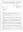
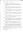

# Kenneth Mackay
(19 January, 1817 - 21 February, 1894)

## Immediate Family

* Brother: [John Mackay](./@69392899@-john-mackay-b-d.md)
* Father: [Alexander Mackay](./@28762468@-alexander-mackay-b1786-d.md) (1786 - )
* Mother: [Christy Fraser](./@91889557@-christy-fraser-b1791-d.md) (1791 - )
* Brother: [William Mackay](./@15516484@-william-mackay-b1826-d.md) (1826 - )
* Brother: [James Mackay](./@57588096@-james-mackay-b1828-d.md) (1828 - )
* Wife: [Isabella Mackay](./@32127758@-isabella-mackay-b1836-8-6-d1862-12-28.md) (6/Aug/1836 - 28/Dec/1862)
* Wife: [Barbara Mackay](./@52409786@-barbara-mackay-b1849~1854-d.md) (bet' 1849 and 1854 - )
* Son: [Alexander Mackay](./@18981292@-alexander-mackay-b1857-d.md) (1857 - )
* Son: [John Mackay](./@23272301@-john-mackay-b1859-d.md) (1859 - )
* Daughter: [Christina Mackay](./@20426296@-christina-mackay-b1861-d.md) (1861 - )
* Son: [Kenneth Mackay](./@32622896@-kenneth-mackay-b1870-d1871-4-29.md) (1870 - 29/Apr/1871)
* Daughter: [Barbra Mackay](./@60643714@-barbra-mackay-b1871-8-25-d.md) (25/Aug/1871 - )
* Daughter: [Bella Mackay](./@64376706@-bella-mackay-b1874-d.md) (1874 - )
* Son: [George Mackay](./@46319502@-george-mackay-b1875-d.md) (about 1875 - )
* Son: [Kenneth Mackay](./@38140776@-kenneth-mackay-b1877-d.md) (about 1877 - )
* Son: [David Mackay](./@66349958@-david-mackay-b1879-d.md) (about 1879 - )
* Son: [Thomas Mackay](./@5045152@-thomas-mackay-b1882-6-27-d1934-11-9.md) (27/Jun/1882 - 9/Nov/1934)
* Daughter: [Bella Mackay](./@54814674@-bella-mackay-b1885-d.md) (about 1885 - )

## Timeline

Date | Item | Description | Sources | Notes
---|---|---|---|---
19/Jan/1817 | Born | Born to [Alexander Mackay](./@28762468@-alexander-mackay-b1786-d.md) and [Christy Fraser](./@91889557@-christy-fraser-b1791-d.md) in Embo, Sutherland, Scotland. | [1](#1), [2](#2) | 
1826 | Birth of brother | [William Mackay](./@15516484@-william-mackay-b1826-d.md) born to [Alexander Mackay](./@28762468@-alexander-mackay-b1786-d.md) and [Christy Fraser](./@91889557@-christy-fraser-b1791-d.md). | [3](#3) | 
1828 | Birth of brother | [James Mackay](./@57588096@-james-mackay-b1828-d.md) born to [Alexander Mackay](./@28762468@-alexander-mackay-b1786-d.md) and [Christy Fraser](./@91889557@-christy-fraser-b1791-d.md). | [3](#3) | 
14/Dec/1855 | Marriage | Married to [Isabella Mackay](./@32127758@-isabella-mackay-b1836-8-6-d1862-12-28.md) at Free Church of Scotland, Dornoch, Sutherland, Scotland | [1](#1) | 
1857 | Birth of son | [Alexander Mackay](./@18981292@-alexander-mackay-b1857-d.md) born to [Kenneth Mackay](./@21362348@-kenneth-mackay-b1817-1-19-d1894-2-21.md) and [Isabella Mackay](./@32127758@-isabella-mackay-b1836-8-6-d1862-12-28.md). | [4](#4) | 
1859 | Birth of son | [John Mackay](./@23272301@-john-mackay-b1859-d.md) born to [Kenneth Mackay](./@21362348@-kenneth-mackay-b1817-1-19-d1894-2-21.md) and [Isabella Mackay](./@32127758@-isabella-mackay-b1836-8-6-d1862-12-28.md). | [4](#4) | 
1861 | Birth of daughter | [Christina Mackay](./@20426296@-christina-mackay-b1861-d.md) born to [Kenneth Mackay](./@21362348@-kenneth-mackay-b1817-1-19-d1894-2-21.md) and [Isabella Mackay](./@32127758@-isabella-mackay-b1836-8-6-d1862-12-28.md). | [4](#4) | 
28/Dec/1862 | Death of partner | [Isabella Mackay](./@32127758@-isabella-mackay-b1836-8-6-d1862-12-28.md) died in Embo, Sutherland, Scotland. | [5](#5) | 
16/Nov/1869 | Marriage | Married to [Barbara Mackay](./@52409786@-barbara-mackay-b1849~1854-d.md)  | [2](#2), [6](#6) | 
1870 | Birth of son | [Kenneth Mackay](./@32622896@-kenneth-mackay-b1870-d1871-4-29.md) born to [Kenneth Mackay](./@21362348@-kenneth-mackay-b1817-1-19-d1894-2-21.md) and [Barbara Mackay](./@52409786@-barbara-mackay-b1849~1854-d.md). | [7](#7) | 
29/Apr/1871 | Death of son | [Kenneth Mackay](./@32622896@-kenneth-mackay-b1870-d1871-4-29.md) died in Embo, Sutherland, Scotland. | [8](#8) | 
25/Aug/1871 | Birth of daughter | [Barbra Mackay](./@60643714@-barbra-mackay-b1871-8-25-d.md) born to [Kenneth Mackay](./@21362348@-kenneth-mackay-b1817-1-19-d1894-2-21.md) and [Barbara Mackay](./@52409786@-barbara-mackay-b1849~1854-d.md) in Embo, Sutherland, Scotland. | [9](#9), [10](#10) | 
1874 | Birth of daughter | [Bella Mackay](./@64376706@-bella-mackay-b1874-d.md) born to [Kenneth Mackay](./@21362348@-kenneth-mackay-b1817-1-19-d1894-2-21.md) and [Barbara Mackay](./@52409786@-barbara-mackay-b1849~1854-d.md). | [10](#10) | 
about 1875 | Birth of son | [George Mackay](./@46319502@-george-mackay-b1875-d.md) born to [Kenneth Mackay](./@21362348@-kenneth-mackay-b1817-1-19-d1894-2-21.md) and [Barbara Mackay](./@52409786@-barbara-mackay-b1849~1854-d.md). | [11](#11) | 
about 1877 | Birth of son | [Kenneth Mackay](./@38140776@-kenneth-mackay-b1877-d.md) born to [Kenneth Mackay](./@21362348@-kenneth-mackay-b1817-1-19-d1894-2-21.md) and [Barbara Mackay](./@52409786@-barbara-mackay-b1849~1854-d.md). | [11](#11) | 
about 1879 | Birth of son | [David Mackay](./@66349958@-david-mackay-b1879-d.md) born to [Kenneth Mackay](./@21362348@-kenneth-mackay-b1817-1-19-d1894-2-21.md) and [Barbara Mackay](./@52409786@-barbara-mackay-b1849~1854-d.md). | [11](#11) | 
27/Jun/1882 | Birth of son | [Thomas Mackay](./@5045152@-thomas-mackay-b1882-6-27-d1934-11-9.md) born to [Kenneth Mackay](./@21362348@-kenneth-mackay-b1817-1-19-d1894-2-21.md) and [Barbara Mackay](./@52409786@-barbara-mackay-b1849~1854-d.md) in Embo, Sutherland, Scotland. | [11](#11), [12](#12), [13](#13) | 
about 1885 | Birth of daughter | [Bella Mackay](./@54814674@-bella-mackay-b1885-d.md) born to [Kenneth Mackay](./@21362348@-kenneth-mackay-b1817-1-19-d1894-2-21.md) and [Barbara Mackay](./@52409786@-barbara-mackay-b1849~1854-d.md). | [11](#11) | 
21/Feb/1894 | Died | Died in Embo, Sutherland, Scotland. | [14](#14) | 

## Known Residences

Date | Residence | Sources & Notes
---|---|---
1841 | Embo, Sutherland, Scotland | [3](#3)
1851 | Embo, Sutherland, Scotland | [15](#15)
1855 | Embo, Sutherland, Scotland | [1](#1)
1861 | Embo, Sutherland, Scotland | [4](#4)
1869 | Embo, Sutherland, Scotland | [6](#6), [2](#2)
1871 | Embo, Sutherland, Scotland | [7](#7)
1881 | Embo, Sutherland, Scotland | [10](#10)
1891 | Embo, Sutherland, Scotland | [11](#11)

## Known Occupations

Date | Occupation | Sources & Notes
---|---|---
1841 | Boat Builder | [3](#3)
1851 | Fisherman | [15](#15)
1855 | Carpenter | [1](#1)
1861 | Boat Builder | [4](#4)
1869 | Fisherman in Embo, Sutherland, Scotland | [6](#6)
1871 | Fisherman | [9](#9), [7](#7)
1881 | Fisherman | [10](#10)
1891 | Fisherman | [11](#11)

## Notes

> Griggs F2.5
>

## Footnotes

### 1

**1855 MACKAY, KENNETH & MACKAY, ISABELLA (Statutory Register of Marriages)**

* [Full text and notes](../sources/@60749102@-1855-mackay,-kenneth-&-mackay,-isabella-statutory-register-of-marriages-.md)
* Date: 14/Dec/1855
* Responsible Agency: National Records of Scotland
* References: 
  * 1855 M 047/ 6

### 2

**1984 TULLOCH, BARRIE M - Letter from Registrar in Brora**

* [Full text and notes](../sources/@94133243@-1984-tulloch,-barrie-m-letter-from-registrar-in-brora.md)
* Originator / Author: John MacLennan
* Date: 19/Jul/1984
* Responsible Agency: Highland Regional Council
*  

### 3

**1841 MACKAY, ALEXANDER & HOUSEHOLD (Census 047/ 5/ 5)**

* [Full text and notes](../sources/@11118948@-1841-mackay,-alexander-&-household-census-047-5-5-.md)
* Date: 1841
* Responsible Agency: National Records of Scotland
* References: 
  * 1841 C 047/ 5/ 5

### 4

**1861 MACKAY, KENNETH & HOUSEHOLD (Census 047/ 1/ 18)**

* [Full text and notes](../sources/@27991824@-1861-mackay,-kenneth-&-household-census-047-1-18-.md)
* Date: 1861
* Responsible Agency: National Records of Scotland
* References: 
  * 1861 C 047/ 1/ 18

### 5

**1862 MACKAY, ISABELLA (Statutory Register of Deaths)**

* [Full text and notes](../sources/@71569491@-1862-mackay,-isabella-statutory-register-of-deaths-.md)
* Date: 29/Dec/1862
* Responsible Agency: National Records of Scotland
* References: 
  * 1862 D 047/ 50

### 6

**1869 MACKAY, KENNETH & MACKAY, BARBARA (Statutory Registers Marriages 047/ 12)**

* [Full text and notes](../sources/@21776288@-1869-mackay,-kenneth-&-mackay,-barbara-statutory-registers-marriages-047-12-.md)
* Responsible Agency: National Records of Scotland
* References: 
  * 1869 M 047/12

### 7

**1871 MACKAY, KENNETH & HOUSEHOLD (Census 047/ 1/L 11)**

* [Full text and notes](../sources/@15948608@-1871-mackay,-kenneth-&-household-census-047-1-l-11-.md)
* Date: 1871
* Responsible Agency: National Records of Scotland
* References: 
  * 1871 C 047/ 1/L 11

### 8

**1871 MACKAY, KENNETH (Statutory Register of Deaths 047/ 11)**

* [Full text and notes](../sources/@90428818@-1871-mackay,-kenneth-statutory-register-of-deaths-047-11-.md)
* Date: 1/May/1871
* Responsible Agency: National Records of Scotland
* References: 
  * 1871 D 047/ 11

### 9

**1871 MACKAY, BARBARA (Statutory Register of Births 047/ 31)**

* [Full text and notes](../sources/@15138960@-1871-mackay,-barbara-statutory-register-of-births-047-31-.md)
* Date: 6/Sep/1871
* Responsible Agency: National Records of Scotland
* References: 
  * 1871 B 047/ 31

### 10

**1881 MACKAY, KENNETH & HOUSEHOLD (Census 047/ 2/ 15)**

* [Full text and notes](../sources/@7896052@-1881-mackay,-kenneth-&-household-census-047-2-15-.md)
* Date: 1881
* Responsible Agency: National Records of Scotland
* References: 
  * 1881 C 047/ 2/ 15

### 11

**1891 MACKAY, KENNETH & FAMILY (Census 047/2/13)**

* [Full text and notes](../sources/@2993134@-1891-mackay,-kenneth-&-family-census-047-2-13-.md)
* Responsible Agency: National Records of Scotland
* References: 
  * 1891 C 047/2/13

### 12

**1882 MACKAY, THOMAS (Statutory Register Births 047/ 40)**

* [Full text and notes](../sources/@19955204@-1882-mackay,-thomas-statutory-register-births-047-40-.md)
* Date: 4/Jul/1882
* Responsible Agency: National Records of Scotland
* References: 
  * 1882 B 047/ 40

### 13

**1919 MACKAY, LUCY Statutory Registers Marriages 644/18 240**

* [Full text and notes](../sources/@28195272@-1919-mackay,-lucy-statutory-registers-marriages-644-18-240.md)
* Responsible Agency: National Records of Scotland
* References: 
  * 1919 M 644/18 240

### 14

**1894 MACKAY, KENNETH (Statutory Register of Death 047/ 6)**

* [Full text and notes](../sources/@30088487@-1894-mackay,-kenneth-statutory-register-of-death-047-6-.md)
* Date: 22/Feb/1894
* Responsible Agency: National Records of Scotland
* References: 
  * 1894 D 047/ 6

### 15

**1851 MACKAY, ALEXANDER & HOUSEHOLD (Census 047/ 5/ 6)**

* [Full text and notes](../sources/@9828029@-1851-mackay,-alexander-&-household-census-047-5-6-.md)
* Date: 1851
* Responsible Agency: National Records of Scotland
* References: 
  * 1851 C 047/ 5/ 6

