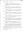

# Kenneth Mackay

## Immediate Family

* Partner: [Jane Gordon](./@19799810@-jane-gordon-b-d.md)
* Daughter: [Betsy Mackay](./@49855242@-betsy-mackay-b1855~1856-d.md) (bet' 1855 and 1856 - )

## Timeline

Date | Item | Description | Sources | Notes
---|---|---|---|---

## Known Occupations

Date | Occupation | Sources & Notes
---|---|---
1881 | Shoemaker (journeyman) | 

## Additional Sources

Footnote | Source
---|---
[1](#1) | **[1984 TULLOCH, BARRIE M - Letter from Registrar in Brora](../sources/@94133243@-1984-tulloch,-barrie-m-letter-from-registrar-in-brora.md)**

## Footnotes

### 1

**1984 TULLOCH, BARRIE M - Letter from Registrar in Brora**

* [Full text and notes](../sources/@94133243@-1984-tulloch,-barrie-m-letter-from-registrar-in-brora.md)
* Originator / Author: John MacLennan
* Date: 19/Jul/1984
* Responsible Agency: Highland Regional Council
*  

