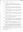

# Hector Matheson
(? - before 1896)

## Immediate Family

* Partner: [Barbara Mackay](./@61459684@-barbara-mackay-b-d1896.md) ( - before 1896)
* Daughter: [Lucy Matheson](./@67811996@-lucy-matheson-b1813~1820-d1896-8-23.md) (bet' 1813 and 1820 - 23/Aug/1896)

## Timeline

Date | Item | Description | Sources | Notes
---|---|---|---|---
before 1896 | Died | Died. | [1](#1) | [2](#2)

## Known Occupations

Date | Occupation | Sources & Notes
---|---|---
before 1896 | Crofter | [3](#3), [1](#1), [4](#4)

## Footnotes

### 1

**1984 TULLOCH, BARRIE M - Letter from Registrar in Brora**

* [Full text and notes](../sources/@94133243@-1984-tulloch,-barrie-m-letter-from-registrar-in-brora.md)
* Originator / Author: John MacLennan
* Date: 19/Jul/1984
* Responsible Agency: Highland Regional Council
*  

### 2

> Don't have a specific date of death - only know it was some time before his daughter as he is marked as already deceased at that point.
>

### 3

**1896 MACKAY, LUCY (Statutory Register of Deaths 047/ 25)**

* [Full text and notes](../sources/@78326520@-1896-mackay,-lucy-statutory-register-of-deaths-047-25-.md)
* Date: 24/Aug/1896
* Responsible Agency: National Records of Scotland
* References: 
  * 1896 D 047/ 25

### 4

> Occupation based on death registration of daughter, so only information on date is that it was some time before the daughter died.
>

