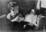
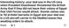

# Derry Roberts
(8 February, 1936 - 8 December, 2025)

## Immediate Family

* Mother: [Mary Elizabeth Wilson](./@99819804@-mary-elizabeth-wilson-b1905-d1971-12-16.md) (about 1905 - 16/Dec/1971)
* Father: [Malcolm DeWitt Roberts](./@21721539@-malcolm-dewitt-roberts-b1905-9-30-d1990-5-6.md) (30/Sep/1905 - 6/May/1990)
* Sister: [Mary Beth Roberts](./@44331192@-mary-beth-roberts-b1930-11-1-d2014-2-6.md) (1/Nov/1930 - 6/Feb/2014)
* Sister: [Sandra Jane Roberts](./@40000604@-sandra-jane-roberts-b1937-11-10-d2019-11-26.md) (10/Nov/1937 - 26/Nov/2019)
* Wife: [Anna Jessie MacKay](./@41265374@-anna-jessie-mackay-b1938-7-7-d2021-3-12.md) (7/Jul/1938 - 12/Mar/2021)
* Sister: X
* Daughter: X
* Daughter: X
* Adopted Son: X
* Adopted Daughter: X
* Adopted Daughter: X
* Adopted Daughter: X

## Timeline

Date | Item | Description | Sources | Notes
---|---|---|---|---
8/Feb/1936 | Born | Born to [Malcolm DeWitt Roberts](./@21721539@-malcolm-dewitt-roberts-b1905-9-30-d1990-5-6.md) and [Mary Elizabeth Wilson](./@99819804@-mary-elizabeth-wilson-b1905-d1971-12-16.md) in Ilion, New York, United States of America. | [1](#1) | 
10/Nov/1937 | Birth of sister | [Sandra Jane Roberts](./@40000604@-sandra-jane-roberts-b1937-11-10-d2019-11-26.md) born to [Malcolm DeWitt Roberts](./@21721539@-malcolm-dewitt-roberts-b1905-9-30-d1990-5-6.md) and [Mary Elizabeth Wilson](./@99819804@-mary-elizabeth-wilson-b1905-d1971-12-16.md) in Ilion, New York, United States of America. | [2](#2), [3](#3) | 
about 1944 | Birth of sister | X born to [Malcolm DeWitt Roberts](./@21721539@-malcolm-dewitt-roberts-b1905-9-30-d1990-5-6.md) and [Mary Elizabeth Wilson](./@99819804@-mary-elizabeth-wilson-b1905-d1971-12-16.md). | [2](#2) | 
30/Jul/1960 | Marriage | Married to [Anna Jessie MacKay](./@41265374@-anna-jessie-mackay-b1938-7-7-d2021-3-12.md) in Bolton, New York, United States of America | [4](#4) | 
6/Sep/1963 | Birth of daughter | X born to [Derry Roberts](./@38836920@-derry-roberts-b1936-2-8-d2025-12-8.md) and [Anna Jessie MacKay](./@41265374@-anna-jessie-mackay-b1938-7-7-d2021-3-12.md). |  | 
15/Mar/1968 | Birth of daughter | X born to [Derry Roberts](./@38836920@-derry-roberts-b1936-2-8-d2025-12-8.md) and [Anna Jessie MacKay](./@41265374@-anna-jessie-mackay-b1938-7-7-d2021-3-12.md). | [5](#5) | 
16/Dec/1971 | Death of mother | [Mary Elizabeth Wilson](./@99819804@-mary-elizabeth-wilson-b1905-d1971-12-16.md) died in Hartford, Hartford County, Connecticut, United States of America. | [6](#6), [7](#7), [8](#8) | 
22/May/1974 | Birth of son | X born to [Derry Roberts](./@38836920@-derry-roberts-b1936-2-8-d2025-12-8.md) and [Anna Jessie MacKay](./@41265374@-anna-jessie-mackay-b1938-7-7-d2021-3-12.md). | [9](#9) | 
12/Sep/1978 | Birth of daughter | X born to [Derry Roberts](./@38836920@-derry-roberts-b1936-2-8-d2025-12-8.md) and [Anna Jessie MacKay](./@41265374@-anna-jessie-mackay-b1938-7-7-d2021-3-12.md). | [10](#10), [11](#11) | 
2/Mar/1982 | Birth of daughter | X born to [Derry Roberts](./@38836920@-derry-roberts-b1936-2-8-d2025-12-8.md) and [Anna Jessie MacKay](./@41265374@-anna-jessie-mackay-b1938-7-7-d2021-3-12.md). | [12](#12) | 
19/Jun/1988 | Birth of daughter | X born to [Derry Roberts](./@38836920@-derry-roberts-b1936-2-8-d2025-12-8.md) and [Anna Jessie MacKay](./@41265374@-anna-jessie-mackay-b1938-7-7-d2021-3-12.md). |  | 
1990 | Honour | Honoured "For Foster Parents Who Have Given Exceptional Care to Sibling Groups" in Bolton Landing, Warren County, New York, United States of America | [13](#13) | 
6/May/1990 | Death of father | [Malcolm DeWitt Roberts](./@21721539@-malcolm-dewitt-roberts-b1905-9-30-d1990-5-6.md) died. | [14](#14), [15](#15) | 
1992 | Honour | Honoured "Bolton Citizen of the Year" in Bolton, New York, United States of America | [16](#16) | 
6/Feb/2014 | Death of sister | [Mary Beth Roberts](./@44331192@-mary-beth-roberts-b1930-11-1-d2014-2-6.md) died in Glens Falls, Warren County, New York, United States of America. | [3](#3), [17](#17) | 
26/Nov/2019 | Death of sister | [Sandra Jane Roberts](./@40000604@-sandra-jane-roberts-b1937-11-10-d2019-11-26.md) died in Bolton Landing, Warren County, New York, United States of America. | [3](#3) | 
12/Mar/2021 | Death of partner | [Anna Jessie MacKay](./@41265374@-anna-jessie-mackay-b1938-7-7-d2021-3-12.md) died in Palm Beach Gardens, Palm Beach County, Florida, United States of America. | [16](#16), [18](#18) | 
8/Dec/2025 | Died | Died in West Palm Beach, Palm Beach, Florida, United States of America. |  | 

## Known Residences

Date | Residence | Sources & Notes
---|---|---
1940 | 21 Philip St, Ilion, New York, United States of America | [19](#19)
1950 | 1239 Post Road, Fairfield, Connecticut, United States of America | [2](#2)
1958 | 62 Cove Ave, East Norwalk, Connecticut, USA | [20](#20)
1967 | Norwalk, Fairfield County, Connecticut, United States of America | [21](#21)
1971 | Stars Plain Road, Danbury, Conn., United States of America | [22](#22), [6](#6)
1972 | Danbury, Fairfield County, Connecticut, United States of America | [8](#8)
1973 | Bolton Landing, Warren County, New York, United States of America | [3](#3)
1979 | 15 Stewart Avenue, Bolton Landing, New York, 12814, USA | [23](#23)
1990 | Bolton Landing, Warren County, New York, United States of America | [15](#15)
1993 | 9 Stewart Avenue, Bolton Landing, New York, 12814, USA | [24](#24)
1994 | Stewart Avenue, Bolton Landing, New York, 12814, USA | [25](#25)
1999 | Bolton Landing, Warren County, New York, United States of America | [26](#26)
2000 | Stewart Avenue, Bolton Landing, New York, 12814, USA | [27](#27), [25](#25)
2006 | West Palm Beach, Palm Beach, Florida, United States of America | [28](#28)
2008 | Palm Beach Gardens, Palm Beach County, Florida, United States of America | [29](#29)
2016 | Palm Beach Gardens, Palm Beach County, Florida, United States of America | [30](#30)
2021 | Palm Beach Gardens, Palm Beach County, Florida, United States of America | [18](#18)
22/Dec/2021 | 52 Dorchester C, West Palm Beach, 33417-1430 | [31](#31), [32](#32), [33](#33), [28](#28)
2023 | 52 Dorchester C, West Palm Beach, Florida, USA | [28](#28)

## Known Occupations

Date | Occupation | Sources & Notes
---|---|---
1958 | US Navy | [20](#20)
1973 | Motel Co-Owner in Bolton Landing, Warren County, New York, United States of America | [3](#3)
before 1973 | Engineer | [34](#34)
1976 | President (Chambers of Commerce) in Bolton, New York, United States of America | [34](#34)
1977 | President (Warrn County Council of Chambers) | [34](#34)
1979 | Unknown in Queensbury, Warren County, New York, United States of America | [34](#34)
1979 | Motel Co-owner in Bolton Landing, Warren County, New York, United States of America | [34](#34)
1981 | Fireman in Bolton Landing, Warren County, New York, United States of America | [35](#35)
1985 | Child day care business owner in Bolton Landing, Warren County, New York, United States of America | [36](#36)
1992 | Child day care business owner in Fort Ann, Washington County, New York, United States of America | [36](#36)

## Additional Sources

Footnote | Source
---|---
[37](#37) | **[ROBERTS/ROBERTS/MACKAY (Photos in frames)](../sources/@78250628@-roberts-roberts-mackay-photos-in-frames-.md)**
[38](#38) | **[1938 ROBERTS, DERRY & ROBERTS, SANDRA (Photo)](../sources/@82260617@-1938-roberts,-derry-&-roberts,-sandra-photo-.md)**
[39](#39) | **[2026 MACKAY, GEORGE (Facebook message)](../sources/@83133984@-2026-mackay,-george-facebook-message-.md)**
[40](#40) | **[X, MALCOLM DEWITT & FAMILY (Photo - 80th Birthday celebrations)](../sources/@85347224@-roberts,-malcolm-dewitt-&-family-photo-80th-birthday-celebrations-.md)**

## Footnotes

### 1

**1936 ROBERTS, DERRY (New York State Birth Index 1881-1942)**

* [Full text and notes](../sources/@52161638@-1936-roberts,-derry-new-york-state-birth-index-1881-1942-.md)
* Publication: Ancestry.com
* Responsible Agency: New York State Department of Health;

### 2

**1950 X (1950 United States Federal Census; Connecticut)**

* [Full text and notes](../sources/@8703207@-1950-roberts-1950-united-states-federal-census;-connecticut-.md)
* Date: 25/Apr/1950

### 3

**2019 X, SANDRA J. (The Post-Star, Glens Falls, New York)**

* [Full text and notes](../sources/@2430456@-2019-pratt,-sandra-j.-the-post-star,-glens-falls,-new-york-.md)
* Publication: The Post-Star, Glens Falls, New York
* Date: 6/Dec/2019

### 4

**1960 ROBERTS, DERRY & MACKAY, ANNA J (New York State Marriage Index, 1881-1967)**

* [Full text and notes](../sources/@62645608@-1960-roberts,-derry-&-mackay,-anna-j-new-york-state-marriage-index,-1881-1967-.md)
* Publication: Ancestry.com
* Responsible Agency: New York State Department of Health
* References: 
  * 34905

### 5

**1993 X, X E (U.S., Public Records Index, 1950-1993, Volume 2)**

* [Full text and notes](../sources/@72528206@-1993-roberts,-mariann-e-u.s.,-public-records-index,-1950-1993,-volume-2-.md)
* Publication: U.S., Public Records Index, 1950-1993, Volume 2

### 6

**1971 X, MARY ELIZABETH - Hartford Courant Sun Dec 19 1971**

* [Full text and notes](../sources/@8607200@-1971-roberts,-mary-elizabeth-hartford-courant-sun-dec-19-1971.md)
* Publication: Hartford Courant
* Date: 19/Dec/1971

### 7

**1971 WILSON, MARY ELIZABETH (The Bridgeport Post, Connecticut, 18 DEC 1971, Page 29)**

* [Full text and notes](../sources/@62984615@-1971-wilson,-mary-elizabeth-the-bridgeport-post,-connecticut,-18-dec-1971,-page-29-.md)
* Publication: The Bridgeport Post

### 8

**1972 X, MARY ELIZABETH WILSON - The Bridgeport Post Thu Jan 13 1972**

* [Full text and notes](../sources/@22454760@-1972-roberts,-mary-elizabeth-wilson-the-bridgeport-post-thu-jan-13-1972.md)
* Publication: The Bridgeport Post
* Date: 13/Jan/1972

### 9

**2022 X, X (Facebook Contact and Basic Info)**

* [Full text and notes](../sources/@58537934@-2022-roberts,-malcolm-facebook-contact-and-basic-info-.md)
* Publication: Facebook
* Originator / Author: X X
* Date: 24/Mar/2022

### 10

**2018 X, X & X, X (Florida, U.S., County Marriage Records)**

* [Full text and notes](../sources/@90940712@-2018-proctor,-lawrence-&-roberts,-christine-florida,-u.s.,-county-marriage-records-.md)
* Publication: Florida, U.S., County Marriage Records

### 11

**2019 X, X A (U.S., Index to Public Records, 1994-2019)**

* [Full text and notes](../sources/@2458276@-2019-roberts,-christine-a-u.s.,-index-to-public-records,-1994-2019-.md)
* Publication: U.S., Index to Public Records, 1994-2019

### 12

**2019 X, X D (U.S., Index to Public Records, 1994-2019)**

* [Full text and notes](../sources/@58739382@-2019-roberts,-rita-d-u.s.,-index-to-public-records,-1994-2019-.md)
* Publication: U.S., Index to Public Records, 1994-2019

### 13

**1990 ROBERTS, ANNA & DERRY (The Post-Star, Glens Falls, 8 AUG 1990, Page 24)**

* [Full text and notes](../sources/@75927450@-1990-roberts,-anna-&-derry-the-post-star,-glens-falls,-8-aug-1990,-page-24-.md)
* Publication: The Post Star
* Date: 8/Aug/1990

### 14

**1990 ROBERTS, MALCOLM D (Connecticut Death Index, 1949-2012)**

* [Full text and notes](../sources/@7140488@-1990-roberts,-malcolm-d-connecticut-death-index,-1949-2012-.md)
* Publication: Connecticut Death Index, 1949-2012

### 15

**1990 X, MALCOLM DEWITT - The Post Star Wed May 9 1990**

* [Full text and notes](../sources/@93810194@-1990-roberts,-malcolm-dewitt-the-post-star-wed-may-9-1990.md)
* Publication: The Post Star
* Date: 9/May/1990

### 16

**2021 ROBERTS, ANNA JESS - Obituary, The Northern Times**

* [Full text and notes](../sources/@55886863@-2021-roberts,-anna-jess-obituary,-the-northern-times.md)
* Publication: The Northern Times
* Date: 6/Apr/2021
* References: 
  * (URL) https://www.northern-times.co.uk/news/anna-jess-roberts-florida-234036/

### 17

**2014 X, MARY BET (The Post Star, Glens Falls, New York)**

* [Full text and notes](../sources/@49992604@-2014-haux,-mary-bet-the-post-star,-glens-falls,-new-york-.md)
* Publication: The Post Star, Glens Falls, New York
* Date: 9/Feb/2014
* References: 
  * (URL) https://poststar.com/lifestyles/announcements/obituaries/mary-bet-haux/article_efc4d664-9207-11e3-8641-001a4bcf887a.html

### 18

**2021 X, ANNA JESSE - Obituary, The Post Star**

* [Full text and notes](../sources/@9852302@-2021-mackay,-anna-jesse-obituary,-the-post-star.md)
* Publication: The POST STAR
* Date: 16/Mar/2021
* References: 
  * (URL) https://www.legacy.com/us/obituaries/poststar/name/anna-roberts-obituary?pid=198059055&fbclid=IwAR2F39iQXzoFaTQV1m_tIRAu2OZ-ZmViqY-A1eMnVYQevymzYILBYghZmS0

### 19

**1940 ROBERTS, MALCOLM & Family (Federal Census)**

* [Full text and notes](../sources/@1486578@-1940-roberts,-malcolm-&-family-federal-census-.md)
* Publication: 1940 Federal Census

### 20

**1958 ROBERTS, DERRY (Norwalk, Connecticut, City Directory, 1958)**

* [Full text and notes](../sources/@11014493@-1958-roberts,-derry-norwalk,-connecticut,-city-directory,-1958-.md)
* Publication: Norwalk, Connecticut, City Directory, 1958

### 21

**1967 X, MRS. (The Glens Falls Times, New York, 4 MAY 1967, Page 3)**

* [Full text and notes](../sources/@69967380@-1967-wilson,-mrs.-the-glens-falls-times,-new-york,-4-may-1967,-page-3-.md)
* Publication: The Glens Falls Times
* Date: 4/May/1967

### 22

**1970s MACKAY, MARY ANN (Passport)**

* [Full text and notes](../sources/@62417636@-1970s-mackay,-mary-ann-passport-.md)
* Date: about 1970

### 23

**2019 ROBERTS, DERRY (U.S., Index to Public Records, 1994-2019)**

* [Full text and notes](../sources/@85861688@-2019-roberts,-derry-u.s.,-index-to-public-records,-1994-2019-.md)
* Publication: Voter Registration Lists, Public Record Filings, Historical Residential Records, and Other Household Database Listings.

### 24

**1993 ROBERTS, DERRY (U.S., Public Records Index, 1950-1993, Volume 1)**

* [Full text and notes](../sources/@79906160@-1993-roberts,-derry-u.s.,-public-records-index,-1950-1993,-volume-1-.md)
* Publication: Voter Registration Lists, Public Record Filings, Historical Residential Records, and Other Household Database Listings.

### 25

**2002 ROBERTS, DERRY (U.S., Phone and Address Directories, 1993-2002)**

* [Full text and notes](../sources/@29849321@-2002-roberts,-derry-u.s.,-phone-and-address-directories,-1993-2002-.md)
* Publication: City: Bolton Landing; State: New York; Year(s): 1994-2002
* Originator / Author: 1993-2002 White Pages. Little Rock, AR, USA: Acxiom Corporation.

### 26

**1999 X, X X (The Post Star, Glens Falls, New York, 18 FEB 1999, Page 13)**

* [Full text and notes](../sources/@45931272@-1999-burdett,-baylee-tre-the-post-star,-glens-falls,-new-york,-18-feb-1999,-page-13-.md)
* Publication: The Post Star, Glens Falls, New York
* Date: 18/Feb/1999

### 27

**2000 X, X ELIZAETH - The Post Star Fri Apr 21 2000**

* [Full text and notes](../sources/@71884324@-2000-roberts,-mackenzie-elizaeth-the-post-star-fri-apr-21-2000.md)
* Publication: The Post Star
* Date: 21/Apr/2000

### 28

**2023 ROBERTS, DERRY (U.S. Voter Registration Records, 1942-2023)**

* [Full text and notes](../sources/@57887688@-2023-roberts,-derry-u.s.-voter-registration-records,-1942-2023-.md)
* Publication: Florida, U.S., Voter Registration Records, 1942-2023
* Date: 2023
* Responsible Agency: Ancestry.com Operations, Inc.

### 29

**2008 X, X X - The Post Star Tuesday June 24 2008**

* [Full text and notes](../sources/@85380635@-2008-huck,-riley-nicole-the-post-star-tuesday-june-24-2008.md)
* Publication: The Post Star
* Date: 24/Jun/2008

### 30

**2016 ROBERTS, ANNA/DERRY - Meals a lifesaver for homebound couple**

* [Full text and notes](../sources/@19633894@-2016-roberts,-anna-derry-meals-a-lifesaver-for-homebound-couple.md)
* Publication: Palm Beach Post
* Date: 22/Mar/2016

### 31

**2021 ROBERTS, DERRY (Estately - Sales record Silverleaf Oak Court)**

* [Full text and notes](../sources/@34475865@-2021-roberts,-derry-estately-sales-record-silverleaf-oak-court-.md)
* Date: 13/Aug/2021
* References: 
  * (URL) https://www.estately.com/listings/info/1401-silverleaf-oak-court--1

### 32

**2021 ROBERTS, DERRY (Facebook Messenger 22 DEC 2021)**

* [Full text and notes](../sources/@5181312@-2021-roberts,-derry-facebook-messenger-22-dec-2021-.md)
* Publication: Facebook Messenger
* Originator / Author: Derry Roberts
* Date: 22/Dec/2021

### 33

**2021 ROBERTS, DERRY (Zillow - Sales record Dorchester)**

* [Full text and notes](../sources/@27115344@-2021-roberts,-derry-zillow-sales-record-dorchester-.md)
* Publication: Zillow
* Date: 27/Aug/2021
* References: 
  * (URL) https://www.zillow.com/homedetails/52-Dorchester-C-West-Palm-Beach-FL-33417/2070302313_zpid/?

### 34

**1979 ROBERTS, DERRY (The Post Star, Glens Falls, New York, 19 JUN 1979, page 13)**

* [Full text and notes](../sources/@32069722@-1979-roberts,-derry-the-post-star,-glens-falls,-new-york,-19-jun-1979,-page-13-.md)
* Publication: The Post Star

### 35

**1981 X, X (U.S., School Yearbooks, 1880-2012)**

* [Full text and notes](../sources/@32590938@-1981-roberts,-deanna-u.s.,-school-yearbooks,-1880-2012-.md)
* Publication: U.S., School Yearbooks, 1880-2012
* Date: 1981

### 36

**1991 ROBERTS, ANNA & DERRY (The Post-Star, Glens Falls, New York, 11 OCT 1992, Page 46)**

* [Full text and notes](../sources/@5016507@-1991-roberts,-anna-&-derry-the-post-star,-glens-falls,-new-york,-11-oct-1992,-page-46-.md)
* Publication: The Post Star
* Date: 11/Oct/1992

### 37

**ROBERTS/ROBERTS/MACKAY (Photos in frames)**

* [Full text and notes](../sources/@78250628@-roberts-roberts-mackay-photos-in-frames-.md)

### 38

**1938 ROBERTS, DERRY & ROBERTS, SANDRA (Photo)**

* [Full text and notes](../sources/@82260617@-1938-roberts,-derry-&-roberts,-sandra-photo-.md)
* Date: about 1938
* 

### 39

**2026 MACKAY, GEORGE (Facebook message)**

* [Full text and notes](../sources/@83133984@-2026-mackay,-george-facebook-message-.md)
* 

### 40

**X, MALCOLM DEWITT & FAMILY (Photo - 80th Birthday celebrations)**

* [Full text and notes](../sources/@85347224@-roberts,-malcolm-dewitt-&-family-photo-80th-birthday-celebrations-.md)
* Date: 30/Sep/1985

