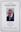
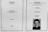

# Alastair McDonald Gibson
(19 January, 1914 - 1978)

## Immediate Family

* Daughter: X
* Father: [Alexander Gibson](./@21968540@-alexander-gibson-b1860-d1939.md) (1860 - before 1939)
* Mother: [Elizabeth Wilson](./@71295041@-elizabeth-wilson-b1872-10-31-d1942.md) (31/Oct/1872 - about 1942)
* Wife: [Margaret McKenzie McIver](./@24380064@-margaret-mckenzie-mciver-b1917-9-29-d2015-9-12.md) (29/Sep/1917 - 12/Sep/2015)
* Son: [Norman Alexander Gibson](./@86606770@-norman-alexander-gibson-b1942-6-19-d2024-4-11.md) (19/Jun/1942 - 11/Apr/2024)

## Timeline

Date | Item | Description | Sources | Notes
---|---|---|---|---
19/Jan/1914 | Born | Born to [Alexander Gibson](./@21968540@-alexander-gibson-b1860-d1939.md) and [Elizabeth Wilson](./@71295041@-elizabeth-wilson-b1872-10-31-d1942.md) in Corstorphine, Midlothian, Scotland. | [1](#1), [2](#2) | 
before 1939 | Death of father | [Alexander Gibson](./@21968540@-alexander-gibson-b1860-d1939.md) died. | [2](#2), [3](#3) | 
1/Sep/1939 | Marriage | Married to [Margaret McKenzie McIver](./@24380064@-margaret-mckenzie-mciver-b1917-9-29-d2015-9-12.md) at 2 St Catherine's Gardens, Cortorphine, Edinburgh, Scotland | [2](#2) | 
about 1942 | Death of mother | [Elizabeth Wilson](./@71295041@-elizabeth-wilson-b1872-10-31-d1942.md) died. | [3](#3) | 
19/Jun/1942 | Birth of son | [Norman Alexander Gibson](./@86606770@-norman-alexander-gibson-b1942-6-19-d2024-4-11.md) born to [Alastair McDonald Gibson](./@3963708@-alastair-mcdonald-gibson-b1914-1-19-d1978.md) and [Margaret McKenzie McIver](./@24380064@-margaret-mckenzie-mciver-b1917-9-29-d2015-9-12.md) in Edinburgh, Scotland. | [3](#3), [4](#4), [5](#5) | 
1978 | Died | Died in Rutherglen, South Lanarkshire, Scotland. | [6](#6) | 

## Known Residences

Date | Residence | Sources & Notes
---|---|---
1939 | 9 St Ninnians Road, Corstorphine, Edinburgh, Scotland | [2](#2)
1946 | 50 Hillview Crescent, Edinburgh, Scotland | [7](#7)

## Known Occupations

Date | Occupation | Sources & Notes
---|---|---
1939 | Minister, Church of Scotland in Edinburgh, Scotland | [2](#2)

## Footnotes

### 1

**1914 GIBSON, ALASTAIR MACDON (Statutory Register Births 678/7)**

* [Full text and notes](../sources/@48317232@-1914-gibson,-alastair-macdon-statutory-register-births-678-7-.md)
* Date: 11/Feb/1914
* Responsible Agency: National Records of Scotland
* References: 
  * 1914 B 678/7

### 2

**1939 GIBSON, ALASTAIR MCDONA (Statutory Registers Marriages 685/1 345)**

* [Full text and notes](../sources/@97538140@-1939-gibson,-alastair-mcdona-statutory-registers-marriages-685-1-345-.md)
* Date: 4/Sep/1939
* Responsible Agency: National Records of Scotland

### 3

**2005 X, NORMAN (Brora - Time and change in a Highland village - a photographic portrait by Norman X)**

* [Full text and notes](../sources/@81726947@-2005-gibson,-norman-brora-time-and-change-in-a-highland-village-a-photographic-portrait-by-norman-g….md)
* Publication: Brora - Time and change in a Highland village - a photographic portrait
* Originator / Author: Norman X
* Date: 2005
* References: 
  * (ISBN) 0-9538642-1-9

### 4

**2024 GIBSON, NORMAN (Funeral Service Programme)**

* [Full text and notes](../sources/@60420349@-2024-gibson,-norman-funeral-service-programme-.md)
* Date: 30/Apr/2024
*   

### 5

**GIBSON, NORMAN (Donn Country: A 300 year legacy)**

* [Full text and notes](../sources/@86248524@-gibson,-norman-donn-country-a-300-year-legacy-.md)
* References: 
  * (URL) https://strathnaver.wixsite.com/donncountry/copy-of-lotte-glob

### 6

**1978 GIBSON, ALASTAIR MACDON (Index - Statutory Register Death 572/94)**

* [Full text and notes](../sources/@27374916@-1978-gibson,-alastair-macdon-index-statutory-register-death-572-94-.md)
* Publication: Index
* Date: 1978
* Responsible Agency: National Records of Scotland
* References: 
  * 1978 D 572/94

### 7

**1946 GIBSON, ALASTAIR M; MARGARET M; M'IVER, HECTOR S; HELEN F; MARGARET P (Register of Voters For the City of Edinburgh and the Burgh of Leith)**

* [Full text and notes](../sources/@79186140@-1946-gibson,-alastair-m;-margaret-m;-m'iver,-hector-s;-helen-f;-margaret-p-register-of-voters-for-t….md)
* Publication: Register of Voters For the City of Edinburgh and the Burgh of Leith
* Date: 1946

