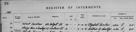
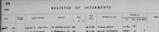
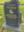
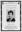
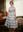
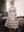

# Anna Jessie MacKay
<img alt="" class="profile-pic" src="data:image/jpg;base64,/9j/4AAQSkZJRgABAQAASABIAAD/4QDIRXhpZgAASUkqAAgAAAAGABIBAwABAAAAAQAAACgBAwABAAAAAgAAABMCAwABAAAAAQAAABoBBQABAAAAVgAAABsBBQABAAAAXgAAAGmHBAABAAAAZgAAAAAAAABIAAAAAQAAAEgAAAABAAAABwAAkAcABAAAADAyMjEBkQcABAAAAAECAwAAoAcABAAAADAxMDABoAMAAQAAAAEAAAACoAMAAQAAAAYGAAADoAMAAQAAAAAIAAAGpAMAAQAAAAAAAAAAAAAA/8AAEQgAyACWAwEiAAIRAQMRAf/EAaIAAAEFAQEBAQEBAAAAAAAAAAABAgMEBQYHCAkKCxAAAgEDAwIEAwUFBAQAAAF9AQIDAAQRBRIhMUEGE1FhByJxFDKBkaEII0KxwRVS0fAkM2JyggkKFhcYGRolJicoKSo0NTY3ODk6Q0RFRkdISUpTVFVWV1hZWmNkZWZnaGlqc3R1dnd4eXqDhIWGh4iJipKTlJWWl5iZmqKjpKWmp6ipqrKztLW2t7i5usLDxMXGx8jJytLT1NXW19jZ2uHi4+Tl5ufo6erx8vP09fb3+Pn6AQADAQEBAQEBAQEBAAAAAAAAAQIDBAUGBwgJCgsRAAIBAgQEAwQHBQQEAAECdwABAgMRBAUhMQYSQVEHYXETIjKBCBRCkaGxwQkjM1LwFWJy0QoWJDThJfEXGBkaJicoKSo1Njc4OTpDREVGR0hJSlNUVVZXWFlaY2RlZmdoaWpzdHV2d3h5eoKDhIWGh4iJipKTlJWWl5iZmqKjpKWmp6ipqrKztLW2t7i5usLDxMXGx8jJytLT1NXW19jZ2uLj5OXm5+jp6vLz9PX29/j5+v/bAIQACAYGBwYFCAcHBwkJCAoMFA0MCwsMGRITDxQdGh8eHRocHCAkLicgIiwjHBwoNyksMDE0NDQfJzk9ODI8LjM0MgEJCQkMCwwYDQ0YMiEcITIyMjIyMjIyMjIyMjIyMjIyMjIyMjIyMjIyMjIyMjIyMjIyMjIyMjIyMjIyMjIyMjIy/9oADAMBAAIRAxEAPwDgmXgUCLI9KkAJFSovFUWVWjqPbg9KuNHzmmFcD3pCK/ljrikMXftVkpWffXBXMa5GKTdhpXHSXEMY+ZxkVCL1WXIU1ElqJo90oI96kSGCAMsjkrjg1m5s0UUTJexlG3Agr1p8MqXA+Xgj1ql/o4MZ3H51ORRFA+QIznA5NNTE4mi0fI4p6xZGTWXa6hLDdCK4H7s8ZPat6NVaMOpyDyKtO5Fir5WTwKUwH0q75Z69BTgg24PSmBniDvipFhyfpVkIOw+lTJFg4x1oArwwZbJq0sWBxUoj+XgVLswvHNMdim8QHWmeWParDjPBpmwUxFdU9qdtwalCjPFKEyc80gIdvb1pPK7GrQTngUvl885oAzb2Rba2L9+2fWsqGKSd/MkViD3q7rbhriKALnaMke9RSSMQkEODJjhVNYzetjSC0CWLy12eeucE7TWPLDI0ojgdnPfHGB9a1o9PkR8SN5kzHkDp9KbcssMb21mvmXBOJHX7qn0qEy2jCuVML/O6ggfw1NZXhLhMjae2etQ3VjL5gVcsx6k022s2WbYytuqtLE63Na4tzMm9VGB155pmm6k9peLHK5MDHBDH7tXreKEW6uHJ52nIzg+hrLu7cwzZ2cHnpSTBo7PbuGBQYyeFBNQ6JOt5aqgx5kYAP07Vsx2+G61undGbVijHbknJHHpU3lYPA5q+kQXPFAhyxOKAKYiNPEJA6ZFWvJPX0HWmsT2HtTAz3iGeRg03yl9qtOvzZpu3/OKYFEKDzU6JnBpqLmrkUXApCGJEM46UPEqAs3AAyatiMdKp62/2bR7hwOSAo/GhuyBas4i4nNxdzSbiAzcE+lXLKTy4HkRQCSAoxyarpbqI9+8MT3JwBVvTjFJJ5MbBmB5b0rkbOqMehu6dpbNbs0jDe6/MR2z2qzFoYty4VRubnpVm2RmKRwnKJ1b1Nb9tZtKRkj61HMb8iRysPhwF0crkgkk/Wkl8PqJBJtA24/lXZzWbKPkGDt/Sqk1s/k5B6DmnzWFy3OD1LRN7XDxghHXJUdyMc/1rINuPs4jmyGXgE12WtwyIkZjJUEYJ964+VpQWSQHIODz1qk7mUo2L3hKQRaqYGAIlUgfUc125twvIrifDiLHrdmud0m45HoMcfjXo7W20/Wt6bujnqaMz0h56ZqRYvmwKuRwjn2poXk45FaEkMkGE6VUeEckflWo8bbB/Kq5iOCR3oAymiweAKTyz6CrbpluOlN8umBkQr61ejXHrxVaFeauxL81IRIoy2fWs7xCm7SDFnl2AH4c1rogGKqa3amezjIBO1u3bNKXwscd0eeppMdyd8052ry3NdF4ZtrK2shcsQomYt7la57UnkErwwggE4IxXW6Ro0ktvE7Kiq6KNqjA4HSuOT0O2mle5rnWtKtUHl27EDqwOAPxNb+mala30SvAwHqhOSKxLzwNb6jFEs8jjYd3ytjP+cU46HFpcx+x7k4AUZ4XtRyq17mmrdrHU3LJDGZJGVVxkk1xd74yt1uWt0RSpJw3OD75x7Vu6nbvIkCEs6sMMD/OopPCel3scPnxAmM5U570JRe4mpJaGKL+G/tzHL35yOfyrj/EUUdnqFtcwSLJBNlXGf1r0+fQ7OCTzYo1BOAQo6n1+tcZ4q0aMRRFF3ujljz0Bzx9KE0nYU1eJW8KaU3/CRW8ir8mdxP4GvT5YgegrjfBAMt3FHj/UwksT35wP613LAZ7muml8Nziq/EUTHj27VGsVXWT5c5qPYVbGOK0IKzJg9M4qtIOuDir5Uk8Diq0qHv1NAGa6nPFN2t6frU8q7ajoC5jw5zV6HO7pVaJOmKuxIV69aALSDjp1qQxiSF4z/EMUxDgCp4xxmgDy69tnk1XdhlVTygH3WHWu/wDDztPYquQNp4qlr+nR2t3DqkaEbnCTEdAD3NaVu0drcqsQAQgHjpXHVjZ2O+hK6udHGtxs+4hH97diqU80PnoJHQfPjlup9BUr3ZEQVOrVCLe2nZWmVDtPBbHBrM6CzemJI1YyIOeNx4pYGaVmEbICDja4P6EdqVorONfnkQj/AGmzVd7iMkCGRCw6YP6U2JO5NcW7/ellBx0VRgCuF8Uw3DgSQM2A2CB3/wA4ruZpS9tuIxkVh+YplaDAaWU4UHp05JoW5M9iXwRpcllp8l1PuEtxjG7+6OldM60QQ+VbxxnnYoWnFT6V3xVlY8tu7uQEZ600qKmK8cU1RnpyaAK7ghD/AEqjLuHGa1JBuXpWfMMYHSgCjIDxgVHhv7tTyk8YqLJoHYx42wavRPyMis+PNWkJHAPXvTJLu/5hj8KsQuM4qnGMmrcIAoEXY8MpU7dp4IbkGsS6tLiG6ecxLHACAApyo+nfHTrWvEPzqyUEiFGGQwwRUzgprUuFRwd0U7RRNCyNyR0rJl0+5sr0yWvlywyEZS4Bk2euOefpVqOf7FeyQOfuHAJ7jtW1Asc4Drgg1w6xdj0001czG/tOOFvJFgp6jFmRgYx3ak0/S91++p3u2W+dBGGCbVRfQAfz61ui2Vf4R+VRSskCFjxVOTF7vRFW9dVQjOAKq6Jbx3c81w+/CkAANgHvg+vQVBfT+e/lL35atXw+iiwkCjB8w/yFVRScjHENqGhq7h1zTS1IRgVG57Y6V2HAOZhUeMAE9KjLHFM3naQelAyVj6GqU5BPPX1qRpMdTVWVsnrmkMrtgGm8UknB7mmZ9jQBkRnirEZH19qqoOKsxr7fjTEXosccirSbSCR61ShyTVyMYFMRZjHI4q5GORVRCF+8QOPWiS/hgUcliTgBaTkluJtIzPEVvi7Eg48yPr6Ef/WxWfYaxdacvKGRB781c1K9kuLtIJ3jVd+xFHqRyM/hUdvZMWMbjkVxVGuZnfh5c0Lot/8ACZRlcC1nLemKpXGp3epMAsRjTsCeavR6bGrfdH0qytqiHAAqDosV7e12Q5Y5Y9TVW4OoW8xexneI8Agcgn3BrbWLA4GT2B9aebYJEmeSDknuSaV2tUDimtSvo2tXFwskOoQBJYyP3kY+Vgehx26VrPtcbkYFT0K8iqiQxwLtRd0sh6e9MVZLKLe5XBJPHAJrphWf2jx5VIub5didhgVETmnpOk4JQ89x3FRuOtb3vqiyGTOeMEfWoivB9qnKE9sVE5PI6DFAFIjJ4pMGnSHB6Zpm4/3aYzITIxxVyIZT5hiqqDkVejA2fTvTJZYtbdp544Yx8znAra/suOGYqzM4GVyBnn6UaFF9mjlunz5n3FGPUZz/ACrYSFnCqeAOWLdjXPUqa2ic85u9kYb6OZEHkliwbDB8A47fhVS6tI7VRKsnmOgyvy4UnoPrzXVi1iZNoYY6k7cbsf0rndcZU3LGOQM/j0H86zeiuyYptpHItE89wbnr5RPlk/qfxNdUiK6xTcgsozVJbLfBFGgwxI5PtzWraxlbBA6/MCRWDd9T6GlSVOKihRGPbHtQIhngVOsYzycCn/xfKPpTKsCwhVz1amgcjAyeiilyQTk/WtGwtfk89hl/4VPaqjHmZ5WMxDb9lD5kcNgYtssgzI3Jx29qSaIMwRtuAM7eo/Gr0sgjQB3yT1b1qi0gSM5LZY5xjrVysjhskZtzaOH87yht5KlRg4/CoVYYAdvmI4rYeJrlVkRM4G0r3Hoao3Vsw4WHdg/My8bfrVRm4s0jKxWxu+tV5BhulPM7RMqTxtG7ZGT0J9jTZG5P6V0RkpK6Nk76oqvjPNN4pz/nTM1QzKUAD3q9p8ZubqGA5w7gH6d6pL05NdDoECwB72XgohYD0HrSnJRjcznLlVzcSP7XeSpEoRA+/LHAOOAB+tW4W+X7+SOpHSq1kskFqJXDKzfOSD684xWhlZkAQFWILbAOG/GuJa+pykMkrONhYBdpzXK3SNLc7TzmTBOc8KP/AK9dKxQHymOWb+L1I5/KsFCBLH64ZvzIom9Dqwq5q0USmPZJGOwz/KpS+Ih/dHIqFv3syemCTVsRZPTgdKxPoBtmDJnecZOandVUHbRGAOFH4mpUjLt047mqR52NxXs/chv+Qy3h3tvcYjHT3PtV5+AF/Ej+QpwQRDe/XsKjALOo7sdxPoK0XY8ZAyfuFBIKsSWz61CkayyCNeVHTPVauoqIrsx3LjkdvaoRJKMKmEy2MKOKbS6ljZZRDGqxHHYY6n3qeCIfZc5U5Y53HAbNNaGGY+buYL0UKOM9+KWdViZUGAqj5cn9aNU7lbGPq9iDEV6qeVI7GufeRii5zkcE11sgLj5ipTPORXMXsZjvJlbjnOK1osum9SoXb1pNx9aUoeuKTb7V0GxV06MXF7DGcbS4z9K7SZFN0lnnejH58DHygZIxXL+HIXaSa6A4hAGT2zz/AErsbBUlmW5ZVBA+9jqOtc1dtuxzVXd2LcgMs8SxEhY0Hynt9aeQiOoVxlsgBOcHuaiTLRZPzeadxbGMnt+FC5R/Nzjau1f61lfUz6jJYxDBPKV+7GcEdQfeuRnmKaqsQycWqtj6u3+FdXcEppN1Ic5kHGe4FcpGnn+LrmMjKx2UA/Muamo9EdmB/jL5mnHAi3UUu4sjAgKrAt19P89K03QKMAfSoo4kjnMvWQjB96sJG87lVz/tN1xUpHZicS6KsneTEt4TPIyKcADLMa0kiR8vEPu/wk9KIYFigKr/ABHHufX+lPlkCArGoAQ4ORnmtUkldnkb6yKz29w7ZMbGpEh8pWZ1zgcj19qeJizrEwGG5JXgj3pJ3KhVUZ3fMaa5UrodktSETCQMpjUEjkjuKYwCKzn+Hn+VSom9uVCt6/40+5aOCNFPL9+KW6uw6XIYFVLQAg5LDbnsTTXXzoVII3qTxntUi3T+W7naqjnpSWZe5iM8sRwjZiBGM+9Gj0HvoVpkOVTBHy8ZGPrXM6gQb9ye4rrrnc6mU5LA7fzrlNRh5ZgOhPP61cNJWKhozPdueKbk+1ROxOMdKbk11nQbfhtUtvD7lsl5mL4PTHQVvRt5VhHGq5L4HTt3/SuZtrryoAsyLHEqhQd+VPtmumsZ1vPnI3xjoeRXFKTlI5JO7L1ugIAG4qvbHSlkVG3IGIUDPuRQHVQdo2g9qSLIDsW+XGBmlpsJEV8iTWkuFk+7tCjp0rl9PTHijUpj91YIFHvhf/r11tw+yykHIZhgdtxrB07THj1S8upXVgzBUVTwAAACffINTNaI6KFVUpOT7Gpa2rTyfP8AKDyT3x7VphIY7dcRgH+EDOPqabbriNp8ZKrhR6moS7s5LAkk81S91GMpNvmluySKdwWJ54yPakK9sdTk0bRkMvQgj8ae6Ec46ilZtak6vcbBGzOZMfKAck/yp0qfIodihyenTGaPMcKBhAo9R1pGaK4Ix95R9zsapWtYrSwyPA6fdHcCobhmnkLf3OKeHeRsKDx0AqExPKWji4z/AKz1Ue3vU6tWRL2Ic/aGCDPkR/M5/vt2H0qwhYYkZyvOR704RCFAgUkD+EDrTWVySznH1qHcFoWEmR4yxX5TkFfesDVVhRvLRSD/ABD61sxJujdQQeQc56Cs7U0DFpUHzDn61tGTsXc4cvhiPQ4o8z60ajsGoTeXkLnofXv+tVsn1rsWqOhO6N+8inSQwrEhmC4jdiSR/tAf07V0eisJrSRCcPGQpbqGbFYzXryzQ281uCuQIpOhdunHritG4uXchIJ9k0By0SD5Vx9Ox9zXA5IxqQcXys2wyRRAbRIwODnufapDKACoVSwHAA4BrPW/hjhilnIiLjuchWx27t17A1NLKscAkXGW4U4xRdoz2Od8V65NY6HPNFl7gsIrZTyTK52r+XX8K3dFthZ6dbQbQzKoUu3JbAxmsOWw/tLWLUOMw2h3gesrf4L/AOhV1+yKPaSNgXGBSjqKHvajX/1e1z8zgfhUKrgnIP1NOmRPPcsxzmlTavKD8TTb1G9yzEpCcDLZ49qSZhxubkd6aqFWy7hTjoevPrTSrgqrDD9vQ+1XfQroROuTkksP0pbfHnAgnC5JwKeyogzI23theTTh9wFCTHyzN3OO1SlqSlrchvJfJtnZcea+FUDjcTT1TyoCAwaRupzWTc3lzNqttGYmaEK7s+PlDZAUfqav9Qp/2cEeo703NdB3uBL9Nxz6N3/GomeQHBJB9Klyc7Tgn9GFKgViVIDnHyg9c+lZbisMgdnMiEj5kIyaq3CkHDLgdMH1q3uVSoCBAwyxHpUF05aF2ZQQnC8cirjpZDPNtXPlapOme+fzFUvOp/iWbytblH+yv8qyftX0rujsdEdj2PTmjNpAhALhQ30z/wDrqSFZZ7mWLyiJoRuDBcIQf4c98/zHtVTTPvR/7i/yrdsv+P26/wB1P5tXAtZGO8m2Y9/pshuEJtdyYGd0mByenHJ79c9vWlu3jgYRlVSGNCQFGAAOtbl9/D/vCub1n7k3/XCX+RonuZ1HuXfD4JsBdumJZR5gHoW5/QED8K0mQtIoPOBk+5qlov8AyCbb/cH/AKDWiP8AXN9BRHYcfhQjQecwYEAj72f506OILJuLA7BkKBT4/wDlr/u0R/ef/dq0le5divICUYnk46/jUqnBww4ABX601v8AVfgaVuq/T+lJElZlII4yB0HqadEG2TbmypXBPbPanN/rE/Gkj/48ZvqKS3EjGt5gNYuiZPlhRFEZ6bjk5/UVpyENK65HIB47NjmsCP8A5DOo/wC9F/6DW3/y8fj/AEqOglsOUb02g/MOR/hSH5iN2Q/qO9La/wCuH0ob/Xj60JaXGTTgFs8E45+tV51VoXUkAMOv8qnf78lVbn/j1P1q3vcb3PJfHWbbX1J4EkKn8siuZ+1D+9XTfEj/AJDVr/17/wDsxrja7Y/CjeL0P//Z"/>
(7 July, 1938 - 12 March, 2021)

## Names

* Anna Jessie MacKay
* Roberts (married name)
* Granna (nickname)
* Anna Jess Mackay (variation)

## Immediate Family

* Father: [William Alexander Mackay](./@9383584@-william-alexander-mackay-b1900-2-24-d1982-9-24.md) (24/Feb/1900 - 24/Sep/1982)
* Mother: [Mary Ann Cumming](./@48241984@-mary-ann-cumming-b1900-7-26-d1981-10-8.md) (26/Jul/1900 - 8/Oct/1981)
* Brother: [Donald James Mackay](./@43065376@-donald-james-mackay-b1931-d2011-12-29.md) (1931 - 29/Dec/2011)
* Brother: X
* Brother: [William Alexander Mackay](./@8407472@-william-alexander-mackay-b1934-2-12-d1934-3-23.md) (12/Feb/1934 - 23/Mar/1934)
* Sister: [Alexina Mackay](./@75066880@-alexina-mackay-b1935-1-11-d1935.md) (11/Jan/1935 - 1935)
* Sister: [Isabella Mackay](./@25303611@-isabella-mackay-b1936-1-1-d2019-12-19.md) (1/Jan/1936 - 19/Dec/2019)
* Husband: [Derry Roberts](./@38836920@-derry-roberts-b1936-2-8-d2025-12-8.md) (8/Feb/1936 - 8/Dec/2025)
* Brother: X
* Brother: X
* Daughter: X
* Daughter: X
* Adopted Son: X
* Adopted Daughter: X
* Adopted Daughter: X
* Adopted Daughter: X

## Timeline

Date | Item | Description | Sources | Notes
---|---|---|---|---
7/Jul/1938 | Born | Born to [William Alexander Mackay](./@9383584@-william-alexander-mackay-b1900-2-24-d1982-9-24.md) and [Mary Ann Cumming](./@48241984@-mary-ann-cumming-b1900-7-26-d1981-10-8.md) in Achiltibue, Ross and Cromarty, Scotland. | [1](#1), [2](#2), [3](#3) | 
1939 | Birth of brother | X born to [William Alexander Mackay](./@9383584@-william-alexander-mackay-b1900-2-24-d1982-9-24.md) and [Mary Ann Cumming](./@48241984@-mary-ann-cumming-b1900-7-26-d1981-10-8.md). | [4](#4) | 
2/Jan/1942 | Birth of brother | X born to [William Alexander Mackay](./@9383584@-william-alexander-mackay-b1900-2-24-d1982-9-24.md) and [Mary Ann Cumming](./@48241984@-mary-ann-cumming-b1900-7-26-d1981-10-8.md) in Embo, Sutherland, Scotland. |  | 
22/Apr/1959 | Immigrated | Immigrated to New York, New York, United States of America, and then residing at 93 Weed Street, New Caanan, Connecticut, USA. | [2](#2) | 
30/Jul/1960 | Marriage | Married to [Derry Roberts](./@38836920@-derry-roberts-b1936-2-8-d2025-12-8.md) in Bolton, New York, United States of America | [5](#5) | 
6/Sep/1963 | Birth of daughter | X born to [Derry Roberts](./@38836920@-derry-roberts-b1936-2-8-d2025-12-8.md) and [Anna Jessie MacKay](./@41265374@-anna-jessie-mackay-b1938-7-7-d2021-3-12.md). |  | 
15/Mar/1968 | Birth of daughter | X born to [Derry Roberts](./@38836920@-derry-roberts-b1936-2-8-d2025-12-8.md) and [Anna Jessie MacKay](./@41265374@-anna-jessie-mackay-b1938-7-7-d2021-3-12.md). | [6](#6) | 
22/May/1974 | Birth of son | X born to [Derry Roberts](./@38836920@-derry-roberts-b1936-2-8-d2025-12-8.md) and [Anna Jessie MacKay](./@41265374@-anna-jessie-mackay-b1938-7-7-d2021-3-12.md). | [7](#7) | 
12/Sep/1978 | Birth of daughter | X born to [Derry Roberts](./@38836920@-derry-roberts-b1936-2-8-d2025-12-8.md) and [Anna Jessie MacKay](./@41265374@-anna-jessie-mackay-b1938-7-7-d2021-3-12.md). | [8](#8), [9](#9) | 
8/Oct/1981 | Death of mother | [Mary Ann Cumming](./@48241984@-mary-ann-cumming-b1900-7-26-d1981-10-8.md) died in Glasgow, Scotland. | [10](#10), [11](#11), [12](#12), [13](#13) | 
2/Mar/1982 | Birth of daughter | X born to [Derry Roberts](./@38836920@-derry-roberts-b1936-2-8-d2025-12-8.md) and [Anna Jessie MacKay](./@41265374@-anna-jessie-mackay-b1938-7-7-d2021-3-12.md). | [14](#14) | 
24/Sep/1982 | Death of father | [William Alexander Mackay](./@9383584@-william-alexander-mackay-b1900-2-24-d1982-9-24.md) died in Glasgow, Scotland. | [15](#15), [16](#16), [17](#17) | 
30/Sep/1982 | Burial of father | [William Alexander Mackay](./@9383584@-william-alexander-mackay-b1900-2-24-d1982-9-24.md) was buried in Glasgow, Scotland, . | [15](#15), [18](#18) | 
19/Jun/1988 | Birth of daughter | X born to [Derry Roberts](./@38836920@-derry-roberts-b1936-2-8-d2025-12-8.md) and [Anna Jessie MacKay](./@41265374@-anna-jessie-mackay-b1938-7-7-d2021-3-12.md). |  | 
1990 | Honour | Honoured "For Foster Parents Who Have Given Exceptional Care to Sibling Groups" in Bolton Landing, Warren County, New York, United States of America | [19](#19) | 
1992 | Honour | Honoured "Bolton Citizen of the Year" in Bolton, New York, United States of America | [20](#20) | 
29/Dec/2011 | Death of brother | [Donald James Mackay](./@43065376@-donald-james-mackay-b1931-d2011-12-29.md) died in Basingstoke, Hampshire, England. | [4](#4), [21](#21), [22](#22) | 
19/Dec/2019 | Death of sister | [Isabella Mackay](./@25303611@-isabella-mackay-b1936-1-1-d2019-12-19.md) died in Alness, Ross and Cromarty, Scotland. | [23](#23), [24](#24), [25](#25), [26](#26), [27](#27) | 
27/Dec/2019 | Burial of sister | [Isabella Mackay](./@25303611@-isabella-mackay-b1936-1-1-d2019-12-19.md) was buried in Rogart, Sutherland, Scotland. | [25](#25), [26](#26), [27](#27) | 
12/Mar/2021 | Died | Died in Palm Beach Gardens, Palm Beach County, Florida, United States of America. | [3](#3), [20](#20) | 

## Known Residences

Date | Residence | Sources & Notes
---|---|---
1948 | Embo, Sutherland, Scotland | [20](#20)
22/Apr/1959 | 39 Weed Street, New Canaan, Connecticut, USA | [2](#2), [28](#28)
1967 | Norwalk, Fairfield County, Connecticut, United States of America | [29](#29)
1981 | Bolton Landing, Warren County, New York, United States of America | 
1999 | Bolton Landing, Warren County, New York, United States of America | [30](#30)
2000 | Bolton Landing, Warren County, New York, United States of America | [31](#31)
2008 | Palm Beach Gardens, Palm Beach County, Florida, United States of America | [32](#32)
2016 | Palm Beach Gardens, Palm Beach County, Florida, United States of America | [33](#33)
2021 | Palm Beach Gardens, Palm Beach County, Florida, United States of America | [3](#3)

## Known Occupations

Date | Occupation | Sources & Notes
---|---|---
1959 | Nanny in New Canaan, Connecticut, United States of America | [34](#34), [35](#35)
before 1959 | Children's Nurse in Bridge of Weir, Scotland | [3](#3)
1959 | Governess | [3](#3)
1973 | Motel Co-Owner in Bolton Landing, Warren County, New York, United States of America | [36](#36)
1985 | Child day care business owner in Bolton Landing, Warren County, New York, United States of America | [37](#37)
1992 | Child day care business owner in Fort Ann, Washington County, New York, United States of America | [37](#37)

## Additional Sources

Footnote | Source
---|---
[38](#38) | **[1952 X FAMILY (Photo)](../sources/@58403792@-1952-mackay-family-photo-.md)**
[39](#39) | **[Late 1950s - Photo of Anna Jess Mackay](../sources/@60775062@-late-1950s-photo-of-anna-jess-mackay.md)**
[40](#40) | **[1948 X X, ANNA, X (Photo - Sitting on a fence in Embo, Sutherland)](../sources/@66280482@-1948-mackay-george,-anna,-kenneth-photo-sitting-on-a-fence-in-embo,-sutherland-.md)**
[41](#41) | **[1946 X Family Photo (Embo)](../sources/@72624888@-1946-mackay-family-photo-embo-.md)**
[42](#42) | **[ROBERTS/ROBERTS/MACKAY (Photos in frames)](../sources/@78250628@-roberts-roberts-mackay-photos-in-frames-.md)**

## Notes

> Rona Griggs 2016 Ref: F9.2.11.7.4 (sic - should be 9.2.11.6.4)
>

## Footnotes

### 1

**1938 MACKAY, ANNA JESSIE (Statutory Registers Births 075/ 2)**

* [Full text and notes](../sources/@53674115@-1938-mackay,-anna-jessie-statutory-registers-births-075-2-.md)
* Date: 11/Jul/1938
* Responsible Agency: General Register Office for Scotland
* References: 
  * 1938 B 075/ 2

### 2

**1959 MACKAY, ANNA J - New York State, Passenger and Crew Lists, 1917-1967**

* [Full text and notes](../sources/@64284008@-1959-mackay,-anna-j-new-york-state,-passenger-and-crew-lists,-1917-1967.md)
* Responsible Agency: Immigration and Naturalization Service
* References: 
  * A3998 - New York, 1957-1967, roll number 161

### 3

**2021 X, ANNA JESSE - Obituary, The Post Star**

* [Full text and notes](../sources/@9852302@-2021-mackay,-anna-jesse-obituary,-the-post-star.md)
* Publication: The POST STAR
* Date: 16/Mar/2021
* References: 
  * (URL) https://www.legacy.com/us/obituaries/poststar/name/anna-roberts-obituary?pid=198059055&fbclid=IwAR2F39iQXzoFaTQV1m_tIRAu2OZ-ZmViqY-A1eMnVYQevymzYILBYghZmS0

### 4

**P116 Embo - genealogy, Uncle Sandy's Story and a little history**

* [Full text and notes](../sources/@26144122@-p116-embo-genealogy,-uncle-sandy's-story-and-a-little-history.md)
* Publication: Embo - genealogy, Uncle Sandy's Story and a little history
* Originator / Author: Catriona Grigg
* Date: 2016
* Filed by Entry: EMBO/P116/F9.2.11
* References: 
  * (ISBN) 978-1-910205-49-5

### 5

**Derry Roberts/Anna J Mackay in the New York State Marriage Index, 1881-1967**

* Publication: Ancestry.com
* Responsible Agency: New York State Department of Health
* References: 
  * 34905

### 6

**1993 X, X E (U.S., Public Records Index, 1950-1993, Volume 2)**

* [Full text and notes](../sources/@72528206@-1993-roberts,-mariann-e-u.s.,-public-records-index,-1950-1993,-volume-2-.md)
* Publication: U.S., Public Records Index, 1950-1993, Volume 2

### 7

**2022 X, X (Facebook Contact and Basic Info)**

* [Full text and notes](../sources/@58537934@-2022-roberts,-malcolm-facebook-contact-and-basic-info-.md)
* Publication: Facebook
* Originator / Author: X X
* Date: 24/Mar/2022

### 8

**2018 X, X & X, X (Florida, U.S., County Marriage Records)**

* [Full text and notes](../sources/@90940712@-2018-proctor,-lawrence-&-roberts,-christine-florida,-u.s.,-county-marriage-records-.md)
* Publication: Florida, U.S., County Marriage Records

### 9

**2019 X, X A (U.S., Index to Public Records, 1994-2019)**

* [Full text and notes](../sources/@2458276@-2019-roberts,-christine-a-u.s.,-index-to-public-records,-1994-2019-.md)
* Publication: U.S., Index to Public Records, 1994-2019

### 10

**1981 Index entry of Obituary Mary Ann Mackay (Post Star, GF, NY)**

* [Full text and notes](../sources/@26370776@-1981-index-entry-of-obituary-mary-ann-mackay-post-star,-gf,-ny-.md)
* Publication: Newspapers.com Obituary Index 1800-Currentthe o
* Date: 9/Oct/1981
* Responsible Agency: The Post Star (Glen Falls, New York)

### 11

**1981 X, MARY ANN - The Post Star Fri Oct 9 1981**

* [Full text and notes](../sources/@24664672@-1981-mackay,-mary-ann-the-post-star-fri-oct-9-1981.md)
* Publication: The Post Star
* Date: 9/Oct/1981

### 12

**1981 MACKAY, MARY ANN (Register of Interments, Western Necropolis, Glasgow)**

* [Full text and notes](../sources/@27456125@-1981-mackay,-mary-ann-register-of-interments,-western-necropolis,-glasgow-.md)
* 

### 13

**1981 X, MARY ANN (Statutory Register Deaths 613/506)**

* [Full text and notes](../sources/@55484888@-1981-mackay,-mary-ann-statutory-register-deaths-613-506-.md)
* Responsible Agency: National Records of Scotland
* References: 
  * 1981 D 613/506

### 14

**2019 X, X D (U.S., Index to Public Records, 1994-2019)**

* [Full text and notes](../sources/@58739382@-2019-roberts,-rita-d-u.s.,-index-to-public-records,-1994-2019-.md)
* Publication: U.S., Index to Public Records, 1994-2019

### 15

**1982 MACKAY, WILLIAM A (Register of Interments, Western Necropolis, Glasgow)**

* [Full text and notes](../sources/@43410300@-1982-mackay,-william-a-register-of-interments,-western-necropolis,-glasgow-.md)
* 

### 16

**1982 X, X ALEXANDER (Register of Deaths)**

* [Full text and notes](../sources/@16124232@-1982-mackay,-william-alexander-register-of-deaths-.md)
* Date: 29/Sep/1982
* Responsible Agency: General Register Office
* References: 
  * 10738085

### 17

**1982 X, X ALEXANDER (X Gilchrist Funerals Ltd. Invoice)**

* [Full text and notes](../sources/@68614544@-1982-mackay,-william-alexander-william-gilchrist-funerals-ltd.-invoice-.md)
* Date: 4/Oct/1982
* Responsible Agency: WIlliam Gilchrist (Funerals) Ltd.
* References: 
  * C/922/N

### 18

**1983 X, X ALEXANDER; MARY ANN (Various documents relating to the memorial plot)**

* [Full text and notes](../sources/@42662686@-1983-mackay,-william-alexander;-mary-ann-various-documents-relating-to-the-memorial-plot-.md)

### 19

**1990 ROBERTS, ANNA & DERRY (The Post-Star, Glens Falls, 8 AUG 1990, Page 24)**

* [Full text and notes](../sources/@75927450@-1990-roberts,-anna-&-derry-the-post-star,-glens-falls,-8-aug-1990,-page-24-.md)
* Publication: The Post Star
* Date: 8/Aug/1990

### 20

**2021 ROBERTS, ANNA JESS - Obituary, The Northern Times**

* [Full text and notes](../sources/@55886863@-2021-roberts,-anna-jess-obituary,-the-northern-times.md)
* Publication: The Northern Times
* Date: 6/Apr/2021
* References: 
  * (URL) https://www.northern-times.co.uk/news/anna-jess-roberts-florida-234036/

### 21

**2011 - MACKAY, Donald James. GreyPower Deceased Data; compiled by Wilmington Millennium; England and Wales Death Indexes**

* [Full text and notes](../sources/@84402844@-2011-mackay,-donald-james.-greypower-deceased-data;-compiled-by-wilmington-millennium;-england-and-….md)

### 22

**2011 MACKAY, DONALD JAMES (Certificate of an entry DEATH)**

* [Full text and notes](../sources/@85365262@-2011-mackay,-donald-james-certificate-of-an-entry-death-.md)
* Date: 30/Dec/2011
* Responsible Agency: General Register Office

### 23

**2019 GILCHRIST, ISABELLA - Statutory Register Deaths**

* [Full text and notes](../sources/@24557976@-2019-gilchrist,-isabella-statutory-register-deaths.md)
* Responsible Agency: National Records of Scotland
* References: 
  * 2019 D 180/49

### 24

**2019 X, ISABELLA - The Herald Death Notices and Announcements**

* [Full text and notes](../sources/@62764866@-2019-gilchrist,-isabella-the-herald-death-notices-and-announcements.md)
* Publication: The Herald
* Date: 21/Dec/2019
* References: 
  * (URL) https://www.heraldscotland.com/announcements/deaths/deaths/18116490.Isabella_Gilchrist/

### 25

**2019 GILCHRIST, ISABELLA (née Mackay) - BillionGraves.com**

* [Full text and notes](../sources/@58460963@-2019-gilchrist,-isabella-née-mackay-billiongraves.com.md)
* Publication: BillionGraves.com
* References: 
  * (URL) https://billiongraves.com/grave/Isabella-Gilchrist-Mackay/134549507

### 26

**2019 GILCHRIST, ISABELLA (née Mackay) - FindAGrave.com**

* [Full text and notes](../sources/@58687268@-2019-gilchrist,-isabella-née-mackay-findagrave.com.md)
* Publication: FindAGrave.com
* References: 
  * (URL) https://www.findagrave.com/memorial/275148419/isabella-gilchrist
* 

### 27

**2019 GILCHRIST, ISABELLA (née Mackay) - Memorial Service programme**

* [Full text and notes](../sources/@53514060@-2019-gilchrist,-isabella-née-mackay-memorial-service-programme.md)
* Date: 27/Dec/2019
*  

### 28

> 93 Weed Street,
>
> New Canaan,
>
> Connecticut,
>
> USA
>

### 29

**1967 X, MRS. (The Glens Falls Times, New York, 4 MAY 1967, Page 3)**

* [Full text and notes](../sources/@69967380@-1967-wilson,-mrs.-the-glens-falls-times,-new-york,-4-may-1967,-page-3-.md)
* Publication: The Glens Falls Times
* Date: 4/May/1967

### 30

**1999 X, X X (The Post Star, Glens Falls, New York, 18 FEB 1999, Page 13)**

* [Full text and notes](../sources/@45931272@-1999-burdett,-baylee-tre-the-post-star,-glens-falls,-new-york,-18-feb-1999,-page-13-.md)
* Publication: The Post Star, Glens Falls, New York
* Date: 18/Feb/1999

### 31

**2000 X, X ELIZAETH - The Post Star Fri Apr 21 2000**

* [Full text and notes](../sources/@71884324@-2000-roberts,-mackenzie-elizaeth-the-post-star-fri-apr-21-2000.md)
* Publication: The Post Star
* Date: 21/Apr/2000

### 32

**2008 X, X X - The Post Star Tuesday June 24 2008**

* [Full text and notes](../sources/@85380635@-2008-huck,-riley-nicole-the-post-star-tuesday-june-24-2008.md)
* Publication: The Post Star
* Date: 24/Jun/2008

### 33

**2016 ROBERTS, ANNA/DERRY - Meals a lifesaver for homebound couple**

* [Full text and notes](../sources/@19633894@-2016-roberts,-anna-derry-meals-a-lifesaver-for-homebound-couple.md)
* Publication: Palm Beach Post
* Date: 22/Mar/2016

### 34

**2020 ROBERTS, ANNA JESS - Facbook post 25/Jan/2020**

* [Full text and notes](../sources/@72153647@-2020-roberts,-anna-jess-facbook-post-25-jan-2020.md)
* Publication: Facebook
* Originator / Author: Colin Mackay
* Date: 25/Jan/2020

### 35

> From Facebook post 25/Jan/2020 by Colin Mackay @ 12:37: Continuing my family tree research... Here is Aunt Anna's arrival record into the USA
>
>  
>
> [image of I-94 landing record, which contains an address in the US]
>
>  
>
> Follow up comment by Colin Mackay at 12:44: And in case anyone is curious: [https://www.google.com/maps/@41.1242245,-73.5003519,3a,69.9y,73.79h,95.46t/data=!3m6!1e1!3m4!1sADRiqNPWrnpThLYT-QdwFg!2e0!7i13312!8i6656](https://www.google.com/maps/@41.1242245,-73.5003519,3a,69.9y,73.79h,95.46t/data=!3m6!1e1!3m4!1sADRiqNPWrnpThLYT-QdwFg!2e0!7i13312!8i6656)
>
>  
>
> Follow up comment by Deanna Robert Roessler @ 21:31: Colin Angus Mackay that is the Resor's house where my mom was a nanny. Governor Resor and his wife Jane had 7 boys. Jane's maiden name was Pillsbury. Yes that Pillsbury. They were amazing people and we had contact with them until I was in my late teens early twenties when Mrs Jane Resor died in a car accident.
>

### 36

**2019 X, SANDRA J. (The Post-Star, Glens Falls, New York)**

* [Full text and notes](../sources/@2430456@-2019-pratt,-sandra-j.-the-post-star,-glens-falls,-new-york-.md)
* Publication: The Post-Star, Glens Falls, New York
* Date: 6/Dec/2019

### 37

**1991 ROBERTS, ANNA & DERRY (The Post-Star, Glens Falls, New York, 11 OCT 1992, Page 46)**

* [Full text and notes](../sources/@5016507@-1991-roberts,-anna-&-derry-the-post-star,-glens-falls,-new-york,-11-oct-1992,-page-46-.md)
* Publication: The Post Star
* Date: 11/Oct/1992

### 38

**1952 X FAMILY (Photo)**

* [Full text and notes](../sources/@58403792@-1952-mackay-family-photo-.md)
* Date: 1952

### 39

**Late 1950s - Photo of Anna Jess Mackay**

* [Full text and notes](../sources/@60775062@-late-1950s-photo-of-anna-jess-mackay.md)
*  

### 40

**1948 X X, ANNA, X (Photo - Sitting on a fence in Embo, Sutherland)**

* [Full text and notes](../sources/@66280482@-1948-mackay-george,-anna,-kenneth-photo-sitting-on-a-fence-in-embo,-sutherland-.md)
* Date: about 1948

### 41

**1946 X Family Photo (Embo)**

* [Full text and notes](../sources/@72624888@-1946-mackay-family-photo-embo-.md)
* Date: about 1946

### 42

**ROBERTS/ROBERTS/MACKAY (Photos in frames)**

* [Full text and notes](../sources/@78250628@-roberts-roberts-mackay-photos-in-frames-.md)

