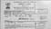
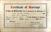
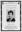
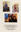
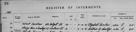

# Mary Ann Cumming
<img alt="Mary Ann Mackay (née Cumming)" class="profile-pic" src="data:image/jpg;base64,/9j/4AAQSkZJRgABAQAAAQABAAD/wAARCADIAMgDASIAAhEBAxEB/8QBogAAAQUBAQEBAQEAAAAAAAAAAAECAwQFBgcICQoLEAACAQMDAgQDBQUEBAAAAX0BAgMABBEFEiExQQYTUWEHInEUMoGRoQgjQrHBFVLR8CQzYnKCCQoWFxgZGiUmJygpKjQ1Njc4OTpDREVGR0hJSlNUVVZXWFlaY2RlZmdoaWpzdHV2d3h5eoOEhYaHiImKkpOUlZaXmJmaoqOkpaanqKmqsrO0tba3uLm6wsPExcbHyMnK0tPU1dbX2Nna4eLj5OXm5+jp6vHy8/T19vf4+foBAAMBAQEBAQEBAQEAAAAAAAABAgMEBQYHCAkKCxEAAgECBAQDBAcFBAQAAQJ3AAECAxEEBSExBhJBUQdhcRMiMoEIFEKRobHBCSMzUvAVYnLRChYkNOEl8RcYGRomJygpKjU2Nzg5OkNERUZHSElKU1RVVldYWVpjZGVmZ2hpanN0dXZ3eHl6goOEhYaHiImKkpOUlZaXmJmaoqOkpaanqKmqsrO0tba3uLm6wsPExcbHyMnK0tPU1dbX2Nna4uPk5ebn6Onq8vP09fb3+Pn6/9sAhAAIBgYHBgUIBwcHCQkICgwUDQwLCwwZEhMPFB0aHx4dGhwcICQuJyAiLCMcHCg3KSwwMTQ0NB8nOT04MjwuMzQyAQkJCQwLDBgNDRgyIRwhMjIyMjIyMjIyMjIyMjIyMjIyMjIyMjIyMjIyMjIyMjIyMjIyMjIyMjIyMjIyMjIyMjL/2gAMAwEAAhEDEQA/AJ21G3kurq02bZEbAB71wfiCI210InUb9xb8K9B1iGCHWIWWMBpTy3oay9c0qHUVE0qkOg647V81Tkos+jWw3wZBeyRxzTcwIv7rPauje5juVuox/rYVzyPWqfhG4RdNazALGI4B9jUF9cGy1SeRAuwALIPUVEvekyGtTF1Y+R9ncdGHzAVf0yZPsCluOvWrTWlrcss7qTHt+QA1X1SOG1tleFtuRgKafkJq5cVw6BhjFcv4qi2WFyR1KcitPS5Z/tCBlIiYZBqHxhEv9kSydyuKqnpUQQVmeV2ymSbCnBxV3RcnxFZk9fNFVLYtHOGQZYA1Y0psa7atg580V7Mtn6EHtSj5cZ6VODn8KrxnOPpUy4yR2r56W5uh+7ANL2FIRxQORjNSAhB9KM4JOOtK3FIemcUAJuIx6UgHzUp5X2o49aAEz8wHrSkkCmsCBu70ooExwLDoM560u496OgGecinBcjg9BTENbjFHXFL1FJnEfHWgBBwevSnbh70HjtTMikFin4tbGoWgWQKGOSR2qdZ7TU7ZlaXBA2sR61h6Iy600jXDgrExI3enpUt3c2tl5yQEDd0A9a6eToa8jvylXT9Wh0Y3aMxbaxAI71kSauZbqaWTcyyHOCe1U5908zqRksc8VHqNt9jtwDyx5zXRGnE61h4pXZswa40rxxlSsYI6HpWqT/acqIxLRqwKkCuHt7iRNjkcH+VdRo+pfZeVAKsd2DU1KdtjlrU+XVHXx26xIFVeF4FYXjMMdDdcfw1cg1+OWZVYYBOKZr4S6t/s+cl+w9Kwi+WSbMIJuR5Jp0f+kAuDt71sWGkP9viuFXhZAa6CHQILMhdu5iM81prbwWcAfO9sfdrpq4u7903jR7mlDdK6lVzkYFXUYOwAPauet9QdNzC34Y9M1btr7ed5UpmuBop0+xuDkHNHJORVKK8Bxv4z1q5FIrjKkGouZuLQ7O5etIckdKXGSO1JyN1Mkac4FHQ0KcHJpWBwcUAHO2hcLtoXJQZ49aTI6mmBIM856UuMYx3pobPGPrTQxCgg/Mp4NACjrj0NP9BTB8zsWzzzmnE9ulAhAcgDGfenbB6UnAHHf0pOaAPMNO1i406GWEJw7ZJ7003rPKzsc85wamitDdowXC7V6mobWIK8hkXcBx9a9PTc9SELamjosJubzcTyQSKuTJFdSm2mABwevYiszSb5bO/AU5AbHPpWrqjxG+8+EDEoy3sal3LvrY59oxDIYgMhTVy2RfJV1Oc9PaqmpH7PJgNkOMkipNH+dQrn5Saqfw3OXEPSxsabC015Ht5APNdZ9hAlaYnLAYHtUOk2UcCfIvJ5zWq6hhjvXnVJ3ZzQVtTJZR84IGR3qCS2Vk2kZDVrNYu0m9lOMYqyLIfuyE/Os7m3MYzaWqLGwXBpX08tEPLAyO1dObMrGVdNwIpYbLZCCF+YVHMyfaI5eK1JhdpFwV7D0oRGgdSoO0nFdJNp5+crxuFQGz8qNWbk+lJu4c1zNeTup+opfNB4J5xyKc1sftLMTgEVUuSIbhUBzz1ppg4pln0pA3HP/wCqgMDj6UAYY9xjOKsxasKQc0HqaTJXH93NOZehB/CmIAOMmggdBTgMUbTycUALuBwPSjtmkOOcDFLjAxzQAuAPpRTc9+9G5vamBxVpBGLOVo2/ecHFU7s7xkJtI6ii1LxNuLc/dPuKLqZZGYDg9xXorc9dPQyDDtuI+cFmwa0JkvbWQpJGTH2YelZtw3+k5B6EHjtVqPW5EPlzZZR071q0zCNWN2mypcCWZ8kcdOa2tCs5JJAu35V71jyXhupwkan5vTrivSvDOkeVZI7jJ6isMRPkjZmFSSk9C1a7oGRRyvQ1rw2+5sYpotDuBPT0rTtYf3gyMV5jdzKUkkSJbBIGDjnGKrSjBGAPl4xWndHEZFU4168dqmTaFDVXZZsQGgHmHDe/arixITsyCayItx3YJ+lTqJEYPzmnGV+hnOnruX5LTcvHJqlcWeYzx+lI97cL17U0as2QmwtkU24sUYVEY95bOoI6N61jT26OSzE7/auxZIr5vnG0isS+skgl+Unk8UkjaMujMYHaFBPA4zVh0wQVPBGKJoQkRyB61Ig3RKvfFUgmQjpjPBqXjFRgjp1pV6euOgqjMUnFLnimgggj0pyn5B7mgBu/58Ec1IST+FRnOTxwO9PP3f50AGBR+FKBwR3ox/nNMDzYTv8Afx8pOKo3dwwkZwOvUelWb6Vl3xqgVUJyKzJJRICM5J6+9erBdS/bytYmg/fwMCBu+8PXFVNheQjPU4Gau6dDvuFYE/L29RRNbg3uI/lbPT0NXfUzvcntNLmS8iOCUZgAw969osrb7Np0SY6ACvMtKlCRxCbG5JASD3r1d2D2ETx4OVBGK83FybaGmIBkcCrloyrJtfr1FV0kCqQR1pC2JB6VyLQGrly9YohY9KoQy5JBq3cZe3PUiqKx/PkelKpua0kuUt22EbnvV0NngjpVOEZIzxWiuCgyOadMxq73IWjR8kj8Kr+QgGAoq9tXOT0qKUDORwDVtERmzNmVoAZIzkgdKzbm7E+RJxIta04xkdaxNQtlcBwME9TUpnXBcyKLzKGwc8+tJDLlzxweKz7yR4V3sfl6fjS2zlwGyeDV8thSjoXwpHJ4GaM7TkDikJOwcZz1pc4HJpmIoHzcjFJnHHoaFOWzSnB6UgFZhkYNKOcnGMVHtGakJ646GgBcHg5pfxNNyQQccelL5n+xTA8/8RWqpqEjQOBvGWX3rn/K4JbqO3rXWa1aRwebcO/zt91T61zkCiT525x1r06T0MgR1hHnLwD1AqpNK005lUEHPapDDtbaW+Uk4FNg/dluM54rWwzYglF3DGcfvAcDFes6NKzaLFG5+ZRXlehRRvfxxMPvfMPrXpIaSJYlj42/e9687Fb2NYK6NVnKKcnmnBxs3Z96hYbwG3cYqKYgR4B7cYriK5S8t/5kZi7mlQHkmqFnC+RKxxx0NTzXqQoXHOO1J6mqhbSJfQAOM8D1q8BtHXIrkP8AhL7OOXZcfJWja+ILGckQ3APHQ1STiZzozfQ3etNfnC96gSbepIPGKzr3XILEYkb5sdqpamUaUpOyRfnABxxms+6jBQr0ytc/ceN7YHYsTrLnB3ipY/EMdypRxtI5FNwa1Z1wpSjuY14xkjmgb7yngVHYSfKiO3U0/VXCXIlHCyHGaghG7oMEHmtegTRu7ucZ7ZoHqahUbcYz0x+FSocqAfWszmFAGOtIACeuKeOR7+lNVRjJ9aBBjknpTkY4wcUh+6KBxj2oAcAW49KXyz6j86TGenWk2tQBxPjNmiurcc7WUnmsOBSyKF6secV3XizSxqFtF5YHmRNk/Q1yjQw6fEI85kJ/KvRpyTijNopahGEePyuDzkVSjgfaXBwRyKvXG15UdckZwc0tpEZ5GQKRgcVsnoI2fDFvuvEnYEbOQT3rvJdxAkRsqw6VyvhyMNGYidrodpzW/BKfJaJmHmwMf+BCuGsryudNPYng1HClXyCp6etTJciV1+uBWWsgkKFwQCcEipIS8F4iPxtOa5mkdMaaZ0aIwjxmsO+l+zZXYZGbPAreibzMehpslirclQT1+lZRavqOMlF2Z5zbztczgGzAxlm8wc5Hat8pAbJpo7cQsuCcVuXdkjRACMbx3Aqk1ozIbfZ985JrolNNG0WrXNq3ulGng45K9a5mebzp5pXTzWRsAYrpYUH2VosfdGM1zi28kd7KygiNzhh71hTlqTRSu2cnr2n3t3P5kMROR82B905rS0qKchba6jIO3KyY7+9dlbWoxgoDnmpmsohzsHrXROrpYbnFM5jUtOd9HkB/1i4ZTWPplwxKCRc84NdbrMgSzcDjjrXHWxMUqnOA1Km7ozqLS50CueF5OKsIFPQYNULaQNISM4xiry/MOKlnEx+7DDHalA3de5zUeTmpM4U889qRLE5oHI5oye5zQOKAHAZPSnY9jTAD69+KX5vegCC9by4myRx3NcJqMYuLoup46V12pyE2sgU8kVzdlYtcvhSCd3NdkHZEsil08eRvOQo2kHFP0iFjdTQkD5BkGuoFonleScFcbcetU7DT2h1qbI+Ux5BqvaaBYbDEbOVpweDjNSzXO+V5Fzlh2q5qcQSz6d6wGlwVI9MEVFrmkWdV4eVLoTRSgHGGB9DUusxtCVcr8wOOPSsDSdWOn3ytjKHhq6rV7u0vbeJ4nBYjoOtc1SLTOulN8yLOmykxoCO1aoIx7n1rGsjsjAJ7cVpQyCTjNc9tRV463FMfm8Cq8yRxS7SfnxWhNLHbR/LyxrCnmMV0zygkOAQfQ+lU1pYmleT8i+h/ctj0rKinjiu2ST7uetXI7+ERyAkYYflWOzebMUiXJzy3apSN4Q3udJ5TQgSKdykZokkXywfUU/T5s2vkycleKgu1CqQD0qmupzx1lZnOat+82xj+JsVy5lBuSF6I2PpXRaw5hPmDgjkVysa/vnkzjeSTzW9JaG9fojesWQnI6GtJDg1g6ZIEdUfP3sit5Tnv0pSVmcUtyTvkjrSEepozkHFA5Xnk0iRV4WnZGcUzhe/FKMMOtAh39KXcaQMUHHXGKb5r+lAzHku7eUkbxjoadai1tYysbodxzXlg1q6A4cVIfEF1jG78a9T6pIXPBnqzXUWflYZ+tLJMkWpwShwVaIo2D3ryseJLrYF+Xj0pw8R3GQT/ADpfVZheB6Xq96rosasMd+etc68v73bnn1rlJPEMsoAdScdwa09GlfUZycHYnWlKjKCuy42eiOlsLd5Q0jrkDoTV6GcLNx0JxUt9ImnaXDFGMuwyawIbqY30aMpCs2Qa5pLmRvTTWx6DaTbowSORxVxXKNuzWZpreZDnuDg1qpAHXg9RXB1OmVupE04eTLvx2FPdUlXa3IrNudPkaGVopSk2cBqykm1CEFZi5/2gOtWopjVNNaM6X+y4DklSB9aheOO2KeXwO+azXur4RAq7shXkY5FUi2pXRXG5QvXPc03Gw1Tl1Zvw3yLdAI4JPBFXZXLLn1rJ07TwJUMnLnkn0NbFygiQjPTpWbMp8qkkjhvEFw6xnnnpXIxzuZjkE810Hii5CXixD0yRWVZ24dgQOh713U0lEzqu8jc09HkZZHHC461tody88H1qpZqAi5A5XHNWhwMehrJ6s52PDY+nenkjaG6Z4qEHDA9fapQcggdM5qWiWKDgYH40o4Y/1o74x25o4J4zikSOB5OaM/WlUHHrS5b0poZ4BSDmuhbwnqg58tT75qIeGdTTObbPB5Br6H2sO5z8rMTjv+FJWo+g6kp5tWwKjGjahu5tXHvinzx7jUWUFUuwVepOK73QrZbe2jj6Zb5jWTp/h4R28t3Of9VyB71tWYP2UEdSPyrkr1FJWR2UaTWrNnUGaWdcDKKMYq1aaZIyx3EyhV/hXH60ui6a1xeRTzFvJUgketb10hNzc8ny4z8g7Yrzas7KyN4P3rEMD+S6M33JOhHrW3C4QDBrFCGbTigA3dRTLXUl/wBW52yLwQa47XN5Q5lY3WTccjoai8pdx7ioLW9R/lzz9auI6l+KVrGdnEZ5IP8ADSPFjoB1qzghetRyEDg9aCVJsiBEbKw6g5qHULvbFJKeABmql7fpEyqrDPeue1jUJdQQ2Fid0soOSDkACtYU3JotpL3mcdqF/wDbdTmkY8FvkNbNgUaCIbh8owa5me2e3ZlfIZRn61sRSi3S1vIjmOX5ZF9K9GcFbQxkr6nXxMdgU9uRVgtnHFULGVZo9yHJ6Y9Ku8delcj0MH5j1zk/Wnq2Ppio1JB+n609T36HNSyWTbhjOOopQCPpUQPQZqYDIUfxClYQbti7yelM+1r7fnVfULhYYHQjJcFcelYefr+dXGDaCxqlFxzTDFhcq+eeambGcGoZpVhQnI+lbpjSuRSAInOCeg96z0eSW8dcgRRLu49alxJeTAeYqMGKrz/EKgtU26Fc3PRpZCD/ACq72R0xppFa8c/2FOxGN8nb0pNNTzJooyMcdKXUoTb6TbQNyWYZFWdFixLI5PypGTzTvobR2Z1mguLrRpJIcboJjGw9q1dVgMUPzcFk5PvXFeFNbj0nUBbXTf6Pfctn+FieDXcajDJPpstuGLTQ/MnPUVy1YHO24VNTI02USWo9ASM/jVPUrUM5YKFLdGp2h5jV1IPl5yAe1atxHHcQbeB3Fcl+VnZe0jloYbmM5Rzle+atL4gltWCzRHJ6Y71Jgh2HcHHNV2hNxdKuOBktxWuj3NWky3/wlsQwvlyZ9MVBdeJpih8uL5jwM1WS3j+2PhcY6GrVpYi4u84BROfxotFEuMUrmXd2V1JG81xORIy52jtXUaToMFhc26KAHWIM7H1IqSDT1u7za65j6t7YqPXruWwt7mYna0i+XGT27CtoNs4a0+aXKjzrU1Wdbg4y8EzI2O4zxUGmf6Rps9qc74zlatC2eBpklOWmhJJB/iHes/TWNvq0a7siUcV2raxaWhqWl9LDbLdIpJi+SVR3HrXQWOoxXS7RkPjo3esy3t0h1ea0K5iuE3c1Vt7eXdNArMJLaTG70B+6axcVITgpHWqT7U8Amse01XDCK6Uo+7YT6MOxrWjnIIJ5BrBxaOaUWiYRtgH05qVcgZoS7jx8657ZFSPJG0BC4znHNSSYd+xlvyuB8q4AHrUHlS/3DRcTGHVpCmMpg89Km/te49IfyrdLQpFGTW45I1EGWJOKmuLhBbqbiINLGCo2nru6flWVpNibmaw8hMvgsVzwSOa2CZZp4Gl08lS7ThV7oOorRpI6qcEiK/Wzh08s8TLPFEIwyn+PrmoblTb6LbQ55dxke9N1SRLo2UUKPHI8pdgR1T+GjUCJdRtoVOAnOKRXUp6+0k11bwoeYxkj1q5YI0VhcsTl/KP4VmX0rSayDnGExWlZunk3Ku4UtCQMnvVPYtbENpGLy8toGZEdodqs3QV1Oi684MMF4WWSI+Wk7DiVRx+YrlEkhSzUxoTO8YjX1U9z+VWoWksGlfetzZCMpEG6o5FQ1cmcFJanbXtgttfC5gwYJeTt6A0xSFGRya5/wn4qMh/s7URkH7h9a6qawEuHtZBjqVPauOrScWZwqcvuzMieBmcsvrnAp9vYyqC2w7j1JrTisLhA2V3E9eavpbTBQrsq/SskpGkq6S0Zx13ZzQ3MjbTjGeK1tJtGe2VUBy33mI4rfGlxSPuYGRvQ9KupamO3MeFVT2rWEW9znq4y6tEqw28cERjUgDGXc+1eceKNXS51ViWzb2cih7Y9ZFP8QrW8ceJDbp/ZWnsPMcHzHB4wP4awNFTTrqODUp0L3Eb7JUPIeMjH5iu6EEldkUI29+RUvShuI2UERAN5W4feQjIrmnU7VljzujYEV0d9IqwwWMjYewmZUJ6tETkflWaLRgZ4xgqc4YelaLQ6zbuGYpp2oDtgMR70Xhlh10CJ1jS/QQMzdAex/PFZlhdPPpUlmwzJH93+lPlkbVtH252zwcj6is0mpakly5gllni+1TKr3ZKSkfwTJ0z9RVEazd6Y6874s4dG7H2q3ZbNSsw8kixi5Gzcx+5MgyPzqleRx3VqwPEzLlhj7sgPIq7a6g1zI6Ww1i1vI1ZW8tm5Ab1rULhU3tjHU157pqmW3ngGTjLIc8g1csdYulhNrI/mKV4J6+4rKVFX0OeVPsX7mUPdzt/C7/KfaocCq9xeweWUGVkHBHpVL7QP+erVXKyDb0HzEgaaJWLQLjI9T0rRhvLiLUp3G79xb4CMOm7qKr+Gf+QZqP8AwD+dWH/5Cmqf9cVoe51p9CCW4Fx4mt42K+XFAFQn+VVLmSK21yU3GRgYAxTB/wAjHH9BUXiP/kPT/X+lOwluUNbMtlrSsUwsiKyt6gisx5JpJJkZyTH8w9xW14u/4+dP/wCvWOsY/wDH7c/9cz/Kt4pWEzp9EurPWJBG/wC41A4SI9EAA5rH1G7YT/ZIyQsb4kHqRR4W/wCRis/97+lVb7/kM3n/AF1NSoq47uxdmkEcEZjBSZyNpHUYr0TwlrK6lGtvcsq3irjrjzB6/WvN7n/W2v0rp/Bf/Iy2v+6awqpNEyinBs9WhtGyCVIqx9kjGGPb1qyn3RTZf9Wa5bHluTbGCRUXKqNvrXK+LvEY0+1a3hb/AElxgY/hFdMf+PdPwrzHxz/yG/8AgIrakr6m2HgpT1OPTfdWtwkh3zwt5oJ6kd6ueH5PNnl0xdo+0AhCeOvI/Wqtj/x933/XI1J4a/5Gqw/Cunod+xPfW9vc30Uhk3F4ikgPVJF4xTdNQ2uo3koVZERAoVuRyMVGf+PyX/r5kqzbf62++iUtkbW0Mo339n6izRxBm24YevvVu21GEahva3ZPMH7xR/Osm/8A+QlJ+FT/APMQ/wCAim1dGS1Zq2cumPJdQyu62Ux3owHKSjofpWnc6hpcl3dtEo8ueFWI29JV9PrXKQf8en/bWpk6n8aGLZmpo8NtLe7ogyyO5yP4duOPxrOngNvfrt5CXDKcDsa0fDv/ACEE/wB6oLz/AI/JP+vhqF8QHKalqckGrTjAwGI/Cq/9uN/dFQa5/wAhW5/36za9GNONloeVUqyUmkf/2Q=="/>
(26 July, 1900 - 8 October, 1981)

## Names

* Mary Ann Cumming
* Mary Ann Mackay (married name)
* Marion Mackay (variation)
* Mary Anne Cumming (variation)

## Immediate Family

* Father: [Donald J Cumming](./@20465544@-donald-j-cumming-b1861-3-22-d1940-2-28.md) (22/Mar/1861 - 28/Feb/1940)
* Mother: [Ann Fraser](./@70425788@-ann-fraser-b1865-9-18-d1946-6-20.md) (18/Sep/1865 - 20/Jun/1946)
* Sister: [Isabella Cumming](./@84684994@-isabella-cumming-b1888-7-21-d1986-2-1.md) (21/Jul/1888 - 1/Feb/1986)
* Sister: [Alexandrina Cumming](./@57186713@-alexandrina-cumming-b1891-3-30-d1987-4-10.md) (30/Mar/1891 - 10/Apr/1987)
* Sister: [Jessie Ann Cumming](./@66222886@-jessie-ann-cumming-b1893-1-8-d1978-10-31.md) (8/Jan/1893 - 31/Oct/1978)
* Brother: [James Cumming](./@492889@-james-cumming-b1894-11-7-d1975-7-2.md) (7/Nov/1894 - 2/Jul/1975)
* Brother: [George Davidson Smith Cumming](./@13773669@-george-davidson-smith-cumming-b1898-5-31-d1965-8.md) (31/May/1898 - Aug/1965)
* Husband: [William Alexander Mackay](./@9383584@-william-alexander-mackay-b1900-2-24-d1982-9-24.md) (24/Feb/1900 - 24/Sep/1982)
* Sister: [Thomasina Ian Cumming](./@92241152@-thomasina-ian-cumming-b1902-11-24-d1973-6-1.md) (24/Nov/1902 - 1/Jun/1973)
* Sister: [Christine Cumming](./@24328630@-christine-cumming-b1904-12-15-d1996-11-10.md) (15/Dec/1904 - 10/Nov/1996)
* Brother: [Donald John Cumming](./@22331378@-donald-john-cumming-b1906-11-29-d1986-3-15.md) (29/Nov/1906 - 15/Mar/1986)
* Son: [Donald James Mackay](./@43065376@-donald-james-mackay-b1931-d2011-12-29.md) (1931 - 29/Dec/2011)
* Son: X
* Son: [William Alexander Mackay](./@8407472@-william-alexander-mackay-b1934-2-12-d1934-3-23.md) (12/Feb/1934 - 23/Mar/1934)
* Daughter: [Alexina Mackay](./@75066880@-alexina-mackay-b1935-1-11-d1935.md) (11/Jan/1935 - 1935)
* Daughter: [Isabella Mackay](./@25303611@-isabella-mackay-b1936-1-1-d2019-12-19.md) (1/Jan/1936 - 19/Dec/2019)
* Daughter: [Anna Jessie MacKay](./@41265374@-anna-jessie-mackay-b1938-7-7-d2021-3-12.md) (7/Jul/1938 - 12/Mar/2021)
* Son: X
* Son: X

## Timeline

Date | Item | Description | Sources | Notes
---|---|---|---|---
26/Jul/1900 | Born | Born to [Donald J Cumming](./@20465544@-donald-j-cumming-b1861-3-22-d1940-2-28.md) and [Ann Fraser](./@70425788@-ann-fraser-b1865-9-18-d1946-6-20.md) in Embo, Sutherland, Scotland. | [1](#1), [2](#2), [3](#3) | 
24/Nov/1902 | Birth of sister | [Thomasina Ian Cumming](./@92241152@-thomasina-ian-cumming-b1902-11-24-d1973-6-1.md) born to [Donald J Cumming](./@20465544@-donald-j-cumming-b1861-3-22-d1940-2-28.md) and [Ann Fraser](./@70425788@-ann-fraser-b1865-9-18-d1946-6-20.md) in Embo, Sutherland, Scotland. | [4](#4), [5](#5) | 
15/Dec/1904 | Birth of sister | [Christine Cumming](./@24328630@-christine-cumming-b1904-12-15-d1996-11-10.md) born to [Donald J Cumming](./@20465544@-donald-j-cumming-b1861-3-22-d1940-2-28.md) and [Ann Fraser](./@70425788@-ann-fraser-b1865-9-18-d1946-6-20.md) in Embo, Sutherland, Scotland. | [6](#6), [7](#7) | 
29/Nov/1906 | Birth of brother | [Donald John Cumming](./@22331378@-donald-john-cumming-b1906-11-29-d1986-3-15.md) born to [Donald J Cumming](./@20465544@-donald-j-cumming-b1861-3-22-d1940-2-28.md) and [Ann Fraser](./@70425788@-ann-fraser-b1865-9-18-d1946-6-20.md) in Embo, Sutherland, Scotland. | [5](#5), [8](#8) | 
1927 | Immigrated | Immigrated to Toronto, York, Ontario, Canada. | [9](#9) | 
2/Mar/1930 | Immigrated | Immigrated to Halifax, Nova Scotia, Canada. | [10](#10) | 
17/Mar/1930 | Marriage Licence | Applied for marriage licence with [William Alexander Mackay](./@9383584@-william-alexander-mackay-b1900-2-24-d1982-9-24.md)  | [11](#11) | 
21/Mar/1930 | Marriage | Married to [William Alexander Mackay](./@9383584@-william-alexander-mackay-b1900-2-24-d1982-9-24.md) in Toronto, York, Ontario, Canada | [5](#5), [11](#11), [12](#12), [13](#13) | 
1931 | Birth of son | [Donald James Mackay](./@43065376@-donald-james-mackay-b1931-d2011-12-29.md) born to [William Alexander Mackay](./@9383584@-william-alexander-mackay-b1900-2-24-d1982-9-24.md) and [Mary Ann Cumming](./@48241984@-mary-ann-cumming-b1900-7-26-d1981-10-8.md) in Toronto, York, Ontario, Canada. | [9](#9), [13](#13), [14](#14) | 
6/Dec/1931 | Immigrated | Immigrated to Embo, Sutherland, Scotland. | [14](#14) | 
27/May/1932 | Birth of son | X born to [William Alexander Mackay](./@9383584@-william-alexander-mackay-b1900-2-24-d1982-9-24.md) and [Mary Ann Cumming](./@48241984@-mary-ann-cumming-b1900-7-26-d1981-10-8.md) in Embo, Sutherland, Scotland. | [15](#15), [16](#16), [17](#17) | 
12/Feb/1934 | Birth of son | [William Alexander Mackay](./@8407472@-william-alexander-mackay-b1934-2-12-d1934-3-23.md) born to [William Alexander Mackay](./@9383584@-william-alexander-mackay-b1900-2-24-d1982-9-24.md) and [Mary Ann Cumming](./@48241984@-mary-ann-cumming-b1900-7-26-d1981-10-8.md) in Embo, Sutherland, Scotland. | [18](#18), [19](#19) | 
23/Mar/1934 | Death of son | [William Alexander Mackay](./@8407472@-william-alexander-mackay-b1934-2-12-d1934-3-23.md) died in Embo, Sutherland, Scotland. | [19](#19) | 
1935 | Death of daughter | [Alexina Mackay](./@75066880@-alexina-mackay-b1935-1-11-d1935.md) died. |  | [20](#20)
11/Jan/1935 | Birth of daughter | [Alexina Mackay](./@75066880@-alexina-mackay-b1935-1-11-d1935.md) born to [William Alexander Mackay](./@9383584@-william-alexander-mackay-b1900-2-24-d1982-9-24.md) and [Mary Ann Cumming](./@48241984@-mary-ann-cumming-b1900-7-26-d1981-10-8.md) in Embo, Sutherland, Scotland. | [21](#21) | 
1/Jan/1936 | Birth of daughter | [Isabella Mackay](./@25303611@-isabella-mackay-b1936-1-1-d2019-12-19.md) born to [William Alexander Mackay](./@9383584@-william-alexander-mackay-b1900-2-24-d1982-9-24.md) and [Mary Ann Cumming](./@48241984@-mary-ann-cumming-b1900-7-26-d1981-10-8.md) in Embo, Sutherland, Scotland. | [22](#22) | 
7/Jul/1938 | Birth of daughter | [Anna Jessie MacKay](./@41265374@-anna-jessie-mackay-b1938-7-7-d2021-3-12.md) born to [William Alexander Mackay](./@9383584@-william-alexander-mackay-b1900-2-24-d1982-9-24.md) and [Mary Ann Cumming](./@48241984@-mary-ann-cumming-b1900-7-26-d1981-10-8.md) in Achiltibue, Ross and Cromarty, Scotland. | [23](#23), [24](#24), [25](#25) | 
1939 | Birth of son | X born to [William Alexander Mackay](./@9383584@-william-alexander-mackay-b1900-2-24-d1982-9-24.md) and [Mary Ann Cumming](./@48241984@-mary-ann-cumming-b1900-7-26-d1981-10-8.md). | [13](#13) | 
28/Feb/1940 | Death of father | [Donald J Cumming](./@20465544@-donald-j-cumming-b1861-3-22-d1940-2-28.md) died in Embo, Sutherland, Scotland. | [26](#26) | 
2/Jan/1942 | Birth of son | X born to [William Alexander Mackay](./@9383584@-william-alexander-mackay-b1900-2-24-d1982-9-24.md) and [Mary Ann Cumming](./@48241984@-mary-ann-cumming-b1900-7-26-d1981-10-8.md) in Embo, Sutherland, Scotland. |  | 
20/Jun/1946 | Death of mother | [Ann Fraser](./@70425788@-ann-fraser-b1865-9-18-d1946-6-20.md) died in Embo, Sutherland, Scotland. | [26](#26), [27](#27), [28](#28) | 
Aug/1965 | Death of brother | [George Davidson Smith Cumming](./@13773669@-george-davidson-smith-cumming-b1898-5-31-d1965-8.md) died in Palm Beach, Florida, United States of America. | [29](#29), [30](#30) | 
1/Jun/1973 | Death of sister | [Thomasina Ian Cumming](./@92241152@-thomasina-ian-cumming-b1902-11-24-d1973-6-1.md) died in Palm Beach, Florida, United States of America. | [31](#31), [32](#32) | 
2/Jul/1975 | Death of brother | [James Cumming](./@492889@-james-cumming-b1894-11-7-d1975-7-2.md) died. | [5](#5) | 
31/Oct/1978 | Death of sister | [Jessie Ann Cumming](./@66222886@-jessie-ann-cumming-b1893-1-8-d1978-10-31.md) died in Palm Beach, Florida, United States of America. | [33](#33), [34](#34) | 
8/Oct/1981 | Died | Died in Glasgow, Scotland. | [35](#35), [36](#36), [37](#37), [38](#38) | 

## Known Residences

Date | Residence | Sources & Notes
---|---|---
1901 | 9 Back Street, Embo, Sutherland, Scotland | [39](#39)
1911 | 9 Front Street, Embo, Sutherland, Scotland | [40](#40)
1921 | Mizpah Cottage, 9 Front Street, Embo, Sutherland, Scotland | [41](#41)
1930 | 146 King Edward Avenue, Toronto, Ontario, Canada | [10](#10), [11](#11), [42](#42)
1/Jun/1931 | 106 Walpole Avenue, Toronto, Candada | [9](#9)
after 6/Dec/1931 | Mizpah Cottage, Embo, Sutherland, Scotland | [14](#14)
1954 | 49 Sandbank Street, Maryhill, Glasgow, Scotland | [43](#43)
1956 | 49 Sandbank Street, Maryhill, Glasgow, Scotland | [44](#44)
1980 | 57 Kersland Street, Glasgow, Scotland | [3](#3)
1981 | 57 Kersland Street, Glasgow, Scotland | [38](#38)

## Known Occupations

Date | Occupation | Sources & Notes
---|---|---
1930 | Nurse in Toronto, York, Ontario, Canada | [11](#11)
1931 | Nurse | [14](#14)

## Footnotes

### 1

**1900 CUMMING, MARY ANN, Statutory Registers Births 047/37**

* [Full text and notes](../sources/@82423595@-1900-cumming,-mary-ann,-statutory-registers-births-047-37.md)
* Date: 13/Aug/1900
* Responsible Agency: National Registers of Scotland
* References: 
  * 1900 B 047/37

### 2

**1970s MACKAY, MARY ANN (Passport)**

* [Full text and notes](../sources/@62417636@-1970s-mackay,-mary-ann-passport-.md)
* Date: about 1970

### 3

**1980 MACKAY, MARY A (National Health Service Medical Card)**

* [Full text and notes](../sources/@4818752@-1980-mackay,-mary-a-national-health-service-medical-card-.md)
* Date: 31/Mar/1980
* Responsible Agency: Greater Glasgow Health Board
* References: 
  * (NHS Number) SXHB-133-1
* 

### 4

**1902 CUMMING, THOMASINA IAN (statutory registers Births 047/55)**

* [Full text and notes](../sources/@35066283@-1902-cumming,-thomasina-ian-statutory-registers-births-047-55-.md)
* Responsible Agency: National Records of Scotland
* References: 
  * 1902 B 047/55

### 5

**P161 Embo - genealogy, Uncle Sandy's Story and a little history**

* [Full text and notes](../sources/@95058656@-p161-embo-genealogy,-uncle-sandy's-story-and-a-little-history.md)
* Publication: Embo - genealogy, Uncle Sandy's Story and a little history
* Originator / Author: Catriona Grigg
* Date: 2016
* Filed by Entry: EMBO/P161/C1.3
* References: 
  * (ISBN) 978-1-910205-49-5

### 6

**1904 CUMMING, CHRISTINA (statutory registers Births 047/55)**

* [Full text and notes](../sources/@54224404@-1904-cumming,-christina-statutory-registers-births-047-55-.md)
* Responsible Agency: National Records of Scotland
* References: 
  * 1904 B 047/55

### 7

**1958 CUMMING, CHRISTINE Incomming passengers 18/Jul/1958 at Southampton on S.S. Maasdam**

* [Full text and notes](../sources/@80083940@-1958-cumming,-christine-incomming-passengers-18-jul-1958-at-southampton-on-s.s.-maasdam.md)

### 8

**1906 CUMMING, (D/R)ONALD JOHN Statutory Registers Births 047/48**

* [Full text and notes](../sources/@10982096@-1906-cumming,-d-r-onald-john-statutory-registers-births-047-48.md)
* Date: 1/Dec/1906
* Responsible Agency: National Records of Scotland
* References: 
  * 1906 B 047/48

### 9

**1931 MACKAY, WILLIAM; MARY ANN; DONALD JAMES (Seventh Census of Canada, Ontario, Toronto Scarborough 160)**

* [Full text and notes](../sources/@75248113@-1931-mackay,-william;-mary-ann;-donald-james-seventh-census-of-canada,-ontario,-toronto-scarborough….md)
* Date: 1/Jun/1931
* Responsible Agency: Dominion Bureau of Statistics

### 10

**1930 MACKAY, MARION C - U.S. Border Crossings from Canada to U.S.**

* [Full text and notes](../sources/@41022732@-1930-mackay,-marion-c-u.s.-border-crossings-from-canada-to-u.s..md)
* Date: 12/Apr/1930

### 11

**1930 MACKAY, WILLIAM ALEXANDER - Marriage to Mary Ann Cumming**

* [Full text and notes](../sources/@27123318@-1930-mackay,-william-alexander-marriage-to-mary-ann-cumming.md)
* Publication: Ontario, Canada, Marriages, 1826-1937
* Date: 17/Mar/1930
* References: 
  * 002154

### 12

**1930 MACKAY, WILLIAM ALEXANDER & CUMMING, MARY ANN (Marriage Certificate)**

* [Full text and notes](../sources/@60240182@-1930-mackay,-william-alexander-&-cumming,-mary-ann-marriage-certificate-.md)
* Date: 21/Mar/1930
* References: 
  * (Registration Certificate Number) 8878
* 

### 13

**P116 Embo - genealogy, Uncle Sandy's Story and a little history**

* [Full text and notes](../sources/@26144122@-p116-embo-genealogy,-uncle-sandy's-story-and-a-little-history.md)
* Publication: Embo - genealogy, Uncle Sandy's Story and a little history
* Originator / Author: Catriona Grigg
* Date: 2016
* Filed by Entry: EMBO/P116/F9.2.11
* References: 
  * (ISBN) 978-1-910205-49-5

### 14

**1931 MACKAY, WILLIAM ALEXANDER - Incomming Passenger Lists, Glasgow Scotland**

* [Full text and notes](../sources/@17071617@-1931-mackay,-william-alexander-incomming-passenger-lists,-glasgow-scotland.md)
* Date: 6/Dec/1931

### 15

**1932 X, X X Statutory Registers - Births Index**

* [Full text and notes](../sources/@38262038@-1932-mackay,-james-william-statutory-registers-births-index.md)
* Responsible Agency: National Records of Scotland

### 16

**2010 X, X (interview as a participant of Fèis a’ Chaolais)**

* [Full text and notes](../sources/@77838632@-2010-mackay,-hamish-interview-as-a-participant-of-fèis-a’-chaolais-.md)
* Publication: Fèis a’ Chaolais: Ar Daoine is Ar Dùthchas
* Date: 2010
* References: 
  * (URL) https://www.feisean.org/wp-content/uploads/Feis-a-Chaolais.pdf

### 17

**2020 X, X - Facebook About page**

* [Full text and notes](../sources/@60498666@-2020-mackay,-hamish-facebook-about-page.md)
* Publication: Facebook.com
* Originator / Author: X X
* Date: 28/May/2020

### 18

**1934 MACKAY, WILLIAM ALEXANDER (Statutory Register of Births 047/ 10)**

* [Full text and notes](../sources/@68242666@-1934-mackay,-william-alexander-statutory-register-of-births-047-10-.md)
* Responsible Agency: National Records of Scotland
* References: 
  * 1934 B 047/ 10

### 19

**1934 MACKAY, WILLIAM ALEXANDER (Statutory Register of Deaths 047/ 7)**

* [Full text and notes](../sources/@52759940@-1934-mackay,-william-alexander-statutory-register-of-deaths-047-7-.md)
* Date: 23/Mar/1934
* Responsible Agency: National Records of Scotland
* References: 
  * 1934 D 047/ 7

### 20

> Oral history
>

### 21

**1935 MACKAY, ALEXINA (Extract of an entry from the Register of Births)**

* [Full text and notes](../sources/@53853408@-1935-mackay,-alexina-extract-of-an-entry-from-the-register-of-births-.md)
* Publication: Extract of an entry from the REGISTER OF BIRTHS of Scotland
* Date: 23/Jan/1935
* Responsible Agency: General Register Office for Scotland
* References: 
  * 1935 047/5

### 22

**2019 GILCHRIST, ISABELLA (née Mackay) - Memorial Service programme**

* [Full text and notes](../sources/@53514060@-2019-gilchrist,-isabella-née-mackay-memorial-service-programme.md)
* Date: 27/Dec/2019
*  

### 23

**1938 MACKAY, ANNA JESSIE (Statutory Registers Births 075/ 2)**

* [Full text and notes](../sources/@53674115@-1938-mackay,-anna-jessie-statutory-registers-births-075-2-.md)
* Date: 11/Jul/1938
* Responsible Agency: General Register Office for Scotland
* References: 
  * 1938 B 075/ 2

### 24

**1959 MACKAY, ANNA J - New York State, Passenger and Crew Lists, 1917-1967**

* [Full text and notes](../sources/@64284008@-1959-mackay,-anna-j-new-york-state,-passenger-and-crew-lists,-1917-1967.md)
* Responsible Agency: Immigration and Naturalization Service
* References: 
  * A3998 - New York, 1957-1967, roll number 161

### 25

**2021 X, ANNA JESSE - Obituary, The Post Star**

* [Full text and notes](../sources/@9852302@-2021-mackay,-anna-jesse-obituary,-the-post-star.md)
* Publication: The POST STAR
* Date: 16/Mar/2021
* References: 
  * (URL) https://www.legacy.com/us/obituaries/poststar/name/anna-roberts-obituary?pid=198059055&fbclid=IwAR2F39iQXzoFaTQV1m_tIRAu2OZ-ZmViqY-A1eMnVYQevymzYILBYghZmS0

### 26

**1940 CUMMING, DONALD (Statutory Register Deaths 047/12)**

* [Full text and notes](../sources/@1894213@-1940-cumming,-donald-statutory-register-deaths-047-12-.md)
* Date: 28/Feb/1928
* Responsible Agency: National Records of Scotland
* References: 
  * 1940 D 047/12

### 27

**1928 GILLIE, WILLIAMINA (statutory registers marriages 098/A99)**

* [Full text and notes](../sources/@32473735@-1928-gillie,-williamina-statutory-registers-marriages-098-a99-.md)
* Date: 3/May/1928
* Responsible Agency: National Records of Scotland
* References: 
  * 1928 M 098/A99

### 28

**1946 CUMMING, ANN (Statutory Registers Deaths 047/11)**

* [Full text and notes](../sources/@34218473@-1946-cumming,-ann-statutory-registers-deaths-047-11-.md)
* Responsible Agency: National Records of Scotland
* References: 
  * 1946 D 

### 29

**1965 CUMMING, GEORGE D S - Florida Death Index**

* [Full text and notes](../sources/@66019328@-1965-cumming,-george-d-s-florida-death-index.md)
* Publication: Florida Death Index 1877-1998

### 30

**1965 CUMMING, GEORGE DAVIDSON SMITH - FindAGrave.com memorial**

* [Full text and notes](../sources/@18107159@-1965-cumming,-george-davidson-smith-findagrave.com-memorial.md)
* Publication: [https://www.findagrave.com/memorial/187602426](https://www.findagrave.com/memorial/187602426)
* Date: 1965
* References: 
  * 187602426

### 31

**1973 CUMMING, THOMASINA I - The Palm Beach Post Mon Jun 4 1974**

* [Full text and notes](../sources/@71047840@-1973-cumming,-thomasina-i-the-palm-beach-post-mon-jun-4-1974.md)
* Publication: The Palm Beach Post
* Date: 4/Jun/1973

### 32

**1973 CUMMING, THOMASINA IAN Death Index**

* [Full text and notes](../sources/@10919610@-1973-cumming,-thomasina-ian-death-index.md)
* Publication: Florida Death Index, 1877-1998
* Responsible Agency: Florida Department of Health

### 33

**1978 CUMMING, JESSIE A. - Find a grave**

* [Full text and notes](../sources/@11068570@-1978-cumming,-jessie-a.-find-a-grave.md)
* Publication: [https://www.findagrave.com](https://www.findagrave.com)
* Date: 1978
* References: 
  * (URL) https://www.findagrave.com/memorial/195703159

### 34

**1978 CUMMING, JESSIE ANN - Florida Death Index**

* [Full text and notes](../sources/@32256946@-1978-cumming,-jessie-ann-florida-death-index.md)

### 35

**1981 Index entry of Obituary Mary Ann Mackay (Post Star, GF, NY)**

* [Full text and notes](../sources/@26370776@-1981-index-entry-of-obituary-mary-ann-mackay-post-star,-gf,-ny-.md)
* Publication: Newspapers.com Obituary Index 1800-Currentthe o
* Date: 9/Oct/1981
* Responsible Agency: The Post Star (Glen Falls, New York)

### 36

**1981 X, MARY ANN - The Post Star Fri Oct 9 1981**

* [Full text and notes](../sources/@24664672@-1981-mackay,-mary-ann-the-post-star-fri-oct-9-1981.md)
* Publication: The Post Star
* Date: 9/Oct/1981

### 37

**1981 MACKAY, MARY ANN (Register of Interments, Western Necropolis, Glasgow)**

* [Full text and notes](../sources/@27456125@-1981-mackay,-mary-ann-register-of-interments,-western-necropolis,-glasgow-.md)
* 

### 38

**1981 X, MARY ANN (Statutory Register Deaths 613/506)**

* [Full text and notes](../sources/@55484888@-1981-mackay,-mary-ann-statutory-register-deaths-613-506-.md)
* Responsible Agency: National Records of Scotland
* References: 
  * 1981 D 613/506

### 39

**1901 CUMMING, DONALD - 1901 Census 047/2/18**

* [Full text and notes](../sources/@9522719@-1901-cumming,-donald-1901-census-047-2-18.md)
* Responsible Agency: National Records of Scotland
* References: 
  * 1901 C 047/2/18

### 40

**1911 CUMMING, DONALD & FAMILY (Census 047/ 3/ 14)**

* [Full text and notes](../sources/@5639012@-1911-cumming,-donald-&-family-census-047-3-14-.md)
* Date: 1911
* Responsible Agency: National Records of Scotland
* References: 
  * 1911 C 047/ 3/ 14

### 41

**1921 CUMMING, DONALD & Household (National Records of Scotland Census 047/ 3/ 11)**

* [Full text and notes](../sources/@2396493@-1921-cumming,-donald-&-household-national-records-of-scotland-census-047-3-11-.md)
* Publication: 1921 Census
* Date: 19/Jun/1921
* References: 
  * 1921 C 047/ 3/ 11

### 42

> Google Maps location: [https://www.google.com/maps/@43.6915899,-79.3118911,3a,17.4y,250.2h,91.32t/data=!3m7!1e1!3m5!1sdKOTWTt7VLA1ylK9EAGmbQ!2e0!6s%2F%2Fgeo0.ggpht.com%2Fcbk%3Fpanoid%3DdKOTWTt7VLA1ylK9EAGmbQ%26output%3Dthumbnail%26cb_client%3Dmaps_sv.tactile.gps%26thumb%3D2%26w%3D203%26h%3D100%26yaw%3D75.0695%26pitch%3D0%26thumbfov%3D100!7i16384!8i8192](https://www.google.com/maps/@43.6915899,-79.3118911,3a,17.4y,250.2h,91.32t/data=!3m7!1e1!3m5!1sdKOTWTt7VLA1ylK9EAGmbQ!2e0!6s%2F%2Fgeo0.ggpht.com%2Fcbk%3Fpanoid%3DdKOTWTt7VLA1ylK9EAGmbQ%26output%3Dthumbnail%26cb_client%3Dmaps_sv.tactile.gps%26thumb%3D2%26w%3D203%26h%3D100%26yaw%3D75.0695%26pitch%3D0%26thumbfov%3D100!7i16384!8i8192)
>

### 43

**1954 X, X A & FAMILY OF VOTING AGE (Register of Voters, Glasgow, Wards 13-26, 1954)**

* [Full text and notes](../sources/@84661563@-1954-mackay,-william-a-&-family-of-voting-age-register-of-voters,-glasgow,-wards-13-26,-1954-.md)
* Publication: Register of Voters, Glasgow, Wards 13-26, 1954

### 44

**1956 X, X A & FAMILY (Glasgow, Lanarkshire, Scotland, Electoral Registers, 1857-1962)**

* [Full text and notes](../sources/@19773398@-1956-mackay,-william-a-&-family-glasgow,-lanarkshire,-scotland,-electoral-registers,-1857-1962-.md)
* Publication: Glasgow, Lanarkshire, Scotland, Electoral Registers, 1857-1962

