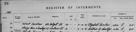

# Alexandrina Cumming
(30 March, 1891 - 10 April, 1987)

## Names

* Alexandrina Cumming
* Alexanderina Cumming (maiden)
* Alexina Cumming (variation)

## Immediate Family

* Father: [Donald J Cumming](./@20465544@-donald-j-cumming-b1861-3-22-d1940-2-28.md) (22/Mar/1861 - 28/Feb/1940)
* Mother: [Ann Fraser](./@70425788@-ann-fraser-b1865-9-18-d1946-6-20.md) (18/Sep/1865 - 20/Jun/1946)
* Sister: [Isabella Cumming](./@84684994@-isabella-cumming-b1888-7-21-d1986-2-1.md) (21/Jul/1888 - 1/Feb/1986)
* Sister: [Jessie Ann Cumming](./@66222886@-jessie-ann-cumming-b1893-1-8-d1978-10-31.md) (8/Jan/1893 - 31/Oct/1978)
* Brother: [James Cumming](./@492889@-james-cumming-b1894-11-7-d1975-7-2.md) (7/Nov/1894 - 2/Jul/1975)
* Brother: [George Davidson Smith Cumming](./@13773669@-george-davidson-smith-cumming-b1898-5-31-d1965-8.md) (31/May/1898 - Aug/1965)
* Sister: [Mary Ann Cumming](./@48241984@-mary-ann-cumming-b1900-7-26-d1981-10-8.md) (26/Jul/1900 - 8/Oct/1981)
* Sister: [Thomasina Ian Cumming](./@92241152@-thomasina-ian-cumming-b1902-11-24-d1973-6-1.md) (24/Nov/1902 - 1/Jun/1973)
* Sister: [Christine Cumming](./@24328630@-christine-cumming-b1904-12-15-d1996-11-10.md) (15/Dec/1904 - 10/Nov/1996)
* Brother: [Donald John Cumming](./@22331378@-donald-john-cumming-b1906-11-29-d1986-3-15.md) (29/Nov/1906 - 15/Mar/1986)

## Timeline

Date | Item | Description | Sources | Notes
---|---|---|---|---
30/Mar/1891 | Born | Born to [Donald J Cumming](./@20465544@-donald-j-cumming-b1861-3-22-d1940-2-28.md) and [Ann Fraser](./@70425788@-ann-fraser-b1865-9-18-d1946-6-20.md) in Embo, Sutherland, Scotland. | [1](#1), [2](#2) | 
8/Jan/1893 | Birth of sister | [Jessie Ann Cumming](./@66222886@-jessie-ann-cumming-b1893-1-8-d1978-10-31.md) born to [Donald J Cumming](./@20465544@-donald-j-cumming-b1861-3-22-d1940-2-28.md) and [Ann Fraser](./@70425788@-ann-fraser-b1865-9-18-d1946-6-20.md) in Embo, Sutherland, Scotland. | [2](#2), [3](#3), [4](#4) | 
7/Nov/1894 | Birth of brother | [James Cumming](./@492889@-james-cumming-b1894-11-7-d1975-7-2.md) born to [Donald J Cumming](./@20465544@-donald-j-cumming-b1861-3-22-d1940-2-28.md) and [Ann Fraser](./@70425788@-ann-fraser-b1865-9-18-d1946-6-20.md) in Embo, Sutherland, Scotland. | [2](#2), [5](#5) | 
31/May/1898 | Birth of brother | [George Davidson Smith Cumming](./@13773669@-george-davidson-smith-cumming-b1898-5-31-d1965-8.md) born to [Donald J Cumming](./@20465544@-donald-j-cumming-b1861-3-22-d1940-2-28.md) and [Ann Fraser](./@70425788@-ann-fraser-b1865-9-18-d1946-6-20.md) in Embo, Sutherland, Scotland. | [2](#2), [6](#6), [7](#7) | 
26/Jul/1900 | Birth of sister | [Mary Ann Cumming](./@48241984@-mary-ann-cumming-b1900-7-26-d1981-10-8.md) born to [Donald J Cumming](./@20465544@-donald-j-cumming-b1861-3-22-d1940-2-28.md) and [Ann Fraser](./@70425788@-ann-fraser-b1865-9-18-d1946-6-20.md) in Embo, Sutherland, Scotland. | [8](#8), [9](#9), [10](#10) | 
24/Nov/1902 | Birth of sister | [Thomasina Ian Cumming](./@92241152@-thomasina-ian-cumming-b1902-11-24-d1973-6-1.md) born to [Donald J Cumming](./@20465544@-donald-j-cumming-b1861-3-22-d1940-2-28.md) and [Ann Fraser](./@70425788@-ann-fraser-b1865-9-18-d1946-6-20.md) in Embo, Sutherland, Scotland. | [2](#2), [11](#11) | 
15/Dec/1904 | Birth of sister | [Christine Cumming](./@24328630@-christine-cumming-b1904-12-15-d1996-11-10.md) born to [Donald J Cumming](./@20465544@-donald-j-cumming-b1861-3-22-d1940-2-28.md) and [Ann Fraser](./@70425788@-ann-fraser-b1865-9-18-d1946-6-20.md) in Embo, Sutherland, Scotland. | [12](#12), [13](#13) | 
29/Nov/1906 | Birth of brother | [Donald John Cumming](./@22331378@-donald-john-cumming-b1906-11-29-d1986-3-15.md) born to [Donald J Cumming](./@20465544@-donald-j-cumming-b1861-3-22-d1940-2-28.md) and [Ann Fraser](./@70425788@-ann-fraser-b1865-9-18-d1946-6-20.md) in Embo, Sutherland, Scotland. | [2](#2), [14](#14) | 
13/Apr/1911 | Immigrated | Immigrated to Boston, Massachusetts, United States of America. | [15](#15) | 
28/Feb/1940 | Death of father | [Donald J Cumming](./@20465544@-donald-j-cumming-b1861-3-22-d1940-2-28.md) died in Embo, Sutherland, Scotland. | [16](#16) | 
10/Jan/1946 | Immigrated | Immigrated to Blaine, Washington, United States of America. | [17](#17) | 
20/Jun/1946 | Death of mother | [Ann Fraser](./@70425788@-ann-fraser-b1865-9-18-d1946-6-20.md) died in Embo, Sutherland, Scotland. | [16](#16), [18](#18), [19](#19) | 
8/Sep/1960 | Naturalised | Naturalised in San Diego, California, United States of America. | [17](#17) | 
Aug/1965 | Death of brother | [George Davidson Smith Cumming](./@13773669@-george-davidson-smith-cumming-b1898-5-31-d1965-8.md) died in Palm Beach, Florida, United States of America. | [20](#20), [21](#21) | 
1/Jun/1973 | Death of sister | [Thomasina Ian Cumming](./@92241152@-thomasina-ian-cumming-b1902-11-24-d1973-6-1.md) died in Palm Beach, Florida, United States of America. | [22](#22), [23](#23) | 
2/Jul/1975 | Death of brother | [James Cumming](./@492889@-james-cumming-b1894-11-7-d1975-7-2.md) died. | [2](#2) | 
31/Oct/1978 | Death of sister | [Jessie Ann Cumming](./@66222886@-jessie-ann-cumming-b1893-1-8-d1978-10-31.md) died in Palm Beach, Florida, United States of America. | [24](#24), [25](#25) | 
8/Oct/1981 | Death of sister | [Mary Ann Cumming](./@48241984@-mary-ann-cumming-b1900-7-26-d1981-10-8.md) died in Glasgow, Scotland. | [26](#26), [27](#27), [28](#28), [29](#29) | 
1/Feb/1986 | Death of sister | [Isabella Cumming](./@84684994@-isabella-cumming-b1888-7-21-d1986-2-1.md) died in Palm Beach, Florida, United States of America. | [30](#30), [31](#31) | 
15/Mar/1986 | Death of brother | [Donald John Cumming](./@22331378@-donald-john-cumming-b1906-11-29-d1986-3-15.md) died in Polk City, Polk, Florida, United States of America. | [32](#32), [33](#33) | 
10/Apr/1987 | Died | Died in West Palm Beach, Palm Beach, Florida, United States of America. | [34](#34), [35](#35), [36](#36) | [37](#37)

## Known Residences

Date | Residence | Sources & Notes
---|---|---
1891 | Embo, Sutherland, Scotland | [38](#38)
1901 | 9 Back Street, Embo, Sutherland, Scotland | [39](#39)
1920 | 16 Beethoven St. Roxbury, Boston, Massachusetts, USA | [40](#40)
1930 | 80 Summit Ave., Brookline, Massachusetts, USA | [41](#41)
1935 | 80 Summit Ave, Brookline, Massachusetts, USA | [42](#42)
1940 | 80 Summit Ave, Brookline, Massachusetts, USA | [42](#42)
1944 | 3219 Oak St, Vancouver, British Columbia, Canada | [43](#43)
1960 | 427, "I" Avenue, National City, San Diego, California, USA | [17](#17), [44](#44)
1987 | West Palm Beach, Palm Beach, 33403, Florida, USA | [35](#35), [45](#45)

## Known Occupations

Date | Occupation | Sources & Notes
---|---|---
1911 | Domestic | [15](#15)
1916 | Tramcar Driver in Glasgow, Scotland | [46](#46)
1933 | Children's Nurse | [47](#47), [48](#48)
1949 | Clothing Business | [49](#49)

## Notes

> Rona Griggs 2016 Ref: C1.3.1.2
>

## Footnotes

### 1

**1891 CUMMING, ALEXANDERINA statutory registers births 047/12**

* [Full text and notes](../sources/@74795264@-1891-cumming,-alexanderina-statutory-registers-births-047-12.md)
* Date: 4/Apr/1891
* Responsible Agency: National Records of Scotland
* References: 
  * 1891 B 047/12

### 2

**P161 Embo - genealogy, Uncle Sandy's Story and a little history**

* [Full text and notes](../sources/@95058656@-p161-embo-genealogy,-uncle-sandy's-story-and-a-little-history.md)
* Publication: Embo - genealogy, Uncle Sandy's Story and a little history
* Originator / Author: Catriona Grigg
* Date: 2016
* Filed by Entry: EMBO/P161/C1.3
* References: 
  * (ISBN) 978-1-910205-49-5

### 3

**1893 CUMMING, JESSIE-ANN (statutory registers Births 047/4)**

* [Full text and notes](../sources/@90907864@-1893-cumming,-jessie-ann-statutory-registers-births-047-4-.md)
* Date: 21/Jan/1893
* Responsible Agency: National Records of Scotland
* References: 
  * 1893 B 047/4

### 4

**1938 CUMMING, JESSIE ANNE - Naturalisation, Declaration of Intent**

* [Full text and notes](../sources/@71979538@-1938-cumming,-jessie-anne-naturalisation,-declaration-of-intent.md)
* Date: 4/Oct/1938

### 5

**1894 CUMMING, JAMES (statutory register of births 047/52)**

* [Full text and notes](../sources/@23080216@-1894-cumming,-james-statutory-register-of-births-047-52-.md)
* Responsible Agency: National Records of Scotland
* References: 
  * 1894 B 047/ 52

### 6

**1898 CUMMING, GEORGE DAVIDSON SMITH - Statutory Registers - Births**

* [Full text and notes](../sources/@42096663@-1898-cumming,-george-davidson-smith-statutory-registers-births.md)
* Responsible Agency: National Records of Scotland
* References: 
  * 1898 B 047/37

### 7

**1942 CUMMING, GEORGE DAVIDSON SMITH - U.S. World War II Draft Card**

* [Full text and notes](../sources/@46960065@-1942-cumming,-george-davidson-smith-u.s.-world-war-ii-draft-card.md)
* Date: 16/Feb/1942

### 8

**1900 CUMMING, MARY ANN, Statutory Registers Births 047/37**

* [Full text and notes](../sources/@82423595@-1900-cumming,-mary-ann,-statutory-registers-births-047-37.md)
* Date: 13/Aug/1900
* Responsible Agency: National Registers of Scotland
* References: 
  * 1900 B 047/37

### 9

**1970s MACKAY, MARY ANN (Passport)**

* [Full text and notes](../sources/@62417636@-1970s-mackay,-mary-ann-passport-.md)
* Date: about 1970

### 10

**1980 MACKAY, MARY A (National Health Service Medical Card)**

* [Full text and notes](../sources/@4818752@-1980-mackay,-mary-a-national-health-service-medical-card-.md)
* Date: 31/Mar/1980
* Responsible Agency: Greater Glasgow Health Board
* References: 
  * (NHS Number) SXHB-133-1
* 

### 11

**1902 CUMMING, THOMASINA IAN (statutory registers Births 047/55)**

* [Full text and notes](../sources/@35066283@-1902-cumming,-thomasina-ian-statutory-registers-births-047-55-.md)
* Responsible Agency: National Records of Scotland
* References: 
  * 1902 B 047/55

### 12

**1904 CUMMING, CHRISTINA (statutory registers Births 047/55)**

* [Full text and notes](../sources/@54224404@-1904-cumming,-christina-statutory-registers-births-047-55-.md)
* Responsible Agency: National Records of Scotland
* References: 
  * 1904 B 047/55

### 13

**1958 CUMMING, CHRISTINE Incomming passengers 18/Jul/1958 at Southampton on S.S. Maasdam**

* [Full text and notes](../sources/@80083940@-1958-cumming,-christine-incomming-passengers-18-jul-1958-at-southampton-on-s.s.-maasdam.md)

### 14

**1906 CUMMING, (D/R)ONALD JOHN Statutory Registers Births 047/48**

* [Full text and notes](../sources/@10982096@-1906-cumming,-d-r-onald-john-statutory-registers-births-047-48.md)
* Date: 1/Dec/1906
* Responsible Agency: National Records of Scotland
* References: 
  * 1906 B 047/48

### 15

**1911 CUMMING, ALEXINA/BELLA & ROSS, ANNIE (Massachusetts, U.S., Arriving Passenger and Crew Lists, 1820-1963)**

* [Full text and notes](../sources/@258384@-1911-cumming,-alexina-bella-&-ross,-annie-massachusetts,-u.s.,-arriving-passenger-and-crew-lists,-1….md)
* Publication: Boston, Massachusetts. Passenger Lists of Vessels Arriving at Boston, Massachusetts, 1891-1943. Micropublication T843. RG085. 454 rolls. National Archives, Washington, D.C.

### 16

**1940 CUMMING, DONALD (Statutory Register Deaths 047/12)**

* [Full text and notes](../sources/@1894213@-1940-cumming,-donald-statutory-register-deaths-047-12-.md)
* Date: 28/Feb/1928
* Responsible Agency: National Records of Scotland
* References: 
  * 1940 D 047/12

### 17

**1960 CUMMING, ALEXANDERINA, Federal Naturalization Records No. 3896**

* [Full text and notes](../sources/@86845954@-1960-cumming,-alexanderina,-federal-naturalization-records-no.-3896.md)
* Date: 8/Sep/1960
* Responsible Agency: US District Court of California at San Diego
* References: 
  * 3896

### 18

**1928 GILLIE, WILLIAMINA (statutory registers marriages 098/A99)**

* [Full text and notes](../sources/@32473735@-1928-gillie,-williamina-statutory-registers-marriages-098-a99-.md)
* Date: 3/May/1928
* Responsible Agency: National Records of Scotland
* References: 
  * 1928 M 098/A99

### 19

**1946 CUMMING, ANN (Statutory Registers Deaths 047/11)**

* [Full text and notes](../sources/@34218473@-1946-cumming,-ann-statutory-registers-deaths-047-11-.md)
* Responsible Agency: National Records of Scotland
* References: 
  * 1946 D 

### 20

**1965 CUMMING, GEORGE D S - Florida Death Index**

* [Full text and notes](../sources/@66019328@-1965-cumming,-george-d-s-florida-death-index.md)
* Publication: Florida Death Index 1877-1998

### 21

**1965 CUMMING, GEORGE DAVIDSON SMITH - FindAGrave.com memorial**

* [Full text and notes](../sources/@18107159@-1965-cumming,-george-davidson-smith-findagrave.com-memorial.md)
* Publication: [https://www.findagrave.com/memorial/187602426](https://www.findagrave.com/memorial/187602426)
* Date: 1965
* References: 
  * 187602426

### 22

**1973 CUMMING, THOMASINA I - The Palm Beach Post Mon Jun 4 1974**

* [Full text and notes](../sources/@71047840@-1973-cumming,-thomasina-i-the-palm-beach-post-mon-jun-4-1974.md)
* Publication: The Palm Beach Post
* Date: 4/Jun/1973

### 23

**1973 CUMMING, THOMASINA IAN Death Index**

* [Full text and notes](../sources/@10919610@-1973-cumming,-thomasina-ian-death-index.md)
* Publication: Florida Death Index, 1877-1998
* Responsible Agency: Florida Department of Health

### 24

**1978 CUMMING, JESSIE A. - Find a grave**

* [Full text and notes](../sources/@11068570@-1978-cumming,-jessie-a.-find-a-grave.md)
* Publication: [https://www.findagrave.com](https://www.findagrave.com)
* Date: 1978
* References: 
  * (URL) https://www.findagrave.com/memorial/195703159

### 25

**1978 CUMMING, JESSIE ANN - Florida Death Index**

* [Full text and notes](../sources/@32256946@-1978-cumming,-jessie-ann-florida-death-index.md)

### 26

**1981 Index entry of Obituary Mary Ann Mackay (Post Star, GF, NY)**

* [Full text and notes](../sources/@26370776@-1981-index-entry-of-obituary-mary-ann-mackay-post-star,-gf,-ny-.md)
* Publication: Newspapers.com Obituary Index 1800-Currentthe o
* Date: 9/Oct/1981
* Responsible Agency: The Post Star (Glen Falls, New York)

### 27

**1981 X, MARY ANN - The Post Star Fri Oct 9 1981**

* [Full text and notes](../sources/@24664672@-1981-mackay,-mary-ann-the-post-star-fri-oct-9-1981.md)
* Publication: The Post Star
* Date: 9/Oct/1981

### 28

**1981 MACKAY, MARY ANN (Register of Interments, Western Necropolis, Glasgow)**

* [Full text and notes](../sources/@27456125@-1981-mackay,-mary-ann-register-of-interments,-western-necropolis,-glasgow-.md)
* 

### 29

**1981 X, MARY ANN (Statutory Register Deaths 613/506)**

* [Full text and notes](../sources/@55484888@-1981-mackay,-mary-ann-statutory-register-deaths-613-506-.md)
* Responsible Agency: National Records of Scotland
* References: 
  * 1981 D 613/506

### 30

**1986 REID, ISABELLA - U.S. Social Security Death Index**

* [Full text and notes](../sources/@92137212@-1986-reid,-isabella-u.s.-social-security-death-index.md)

### 31

**1986 REID, ISABELLA C - Florida Death Index**

* [Full text and notes](../sources/@37485922@-1986-reid,-isabella-c-florida-death-index.md)

### 32

**1986 CUMMING, DONALD JAMES - Obiturary, The Tampa Tribune**

* [Full text and notes](../sources/@62680432@-1986-cumming,-donald-james-obiturary,-the-tampa-tribune.md)
* Publication: The Tampa Tribune
* Date: 17/Mar/1986

### 33

**1986 CUMMING, DONALD JAMES -Florida Death Index, 1986**

### 34

**1987 CUMMING, ALEXINA - The Palm Beach Post Sat Apr 11 1987**

* [Full text and notes](../sources/@20442276@-1987-cumming,-alexina-the-palm-beach-post-sat-apr-11-1987.md)
* Date: 11/Apr/1987

### 35

**1987 CUMMING, ALEXINA U.S. Social Security Death Index, 1935-2014**

* [Full text and notes](../sources/@46642344@-1987-cumming,-alexina-u.s.-social-security-death-index,-1935-2014.md)
* Publication: Ancestry.com

### 36

**1987, CUMMING, ALEXINA, Florida Death Index**

* [Full text and notes](../sources/@82349376@-1987,-cumming,-alexina,-florida-death-index.md)
* Publication: Ancestry.com

### 37

> The names on both the Florida Death Index and U.S. Social Security Death Index are variants of other documented names, but the DoB does match.
>

### 38

**1891 CUMMING, DONALD & FAMILY (1891 Census)**

* [Full text and notes](../sources/@18346226@-1891-cumming,-donald-&-family-1891-census-.md)
* References: 
  * 1891 C 047/2/17

### 39

**1901 CUMMING, DONALD - 1901 Census 047/2/18**

* [Full text and notes](../sources/@9522719@-1901-cumming,-donald-1901-census-047-2-18.md)
* Responsible Agency: National Records of Scotland
* References: 
  * 1901 C 047/2/18

### 40

**1920 CUMMING, GEORGE (New York, U.S., Arriving Passenger and Crew Lists (including Castle Garden and Ellis Island), 1820-1957)**

* [Full text and notes](../sources/@92917027@-1920-cumming,-george-new-york,-u.s.,-arriving-passenger-and-crew-lists-including-castle-garden-and-….md)
* Publication: New York, U.S., Arriving Passenger and Crew Lists (including Castle Garden and Ellis Island), 1820-1957

### 41

**1930 CUMMING, GEORGE / ALEXINA / THOMASINA / CHRISTINE - 1930 United States Federal Census**

* [Full text and notes](../sources/@12992908@-1930-cumming,-george-alexina-thomasina-christine-1930-united-states-federal-census.md)
* Originator / Author: Department of Commerce - Bureau of the Census
* Date: 7/Apr/1930

### 42

**1940 CUMMING, ALEXINA, GEORGE, THOMASINA, & CHRISTINE - 1940 United States Federal Census**

* [Full text and notes](../sources/@80891523@-1940-cumming,-alexina,-george,-thomasina,-&-christine-1940-united-states-federal-census.md)

### 43

**1944 CUMMING THOMASINA IAN, Border Crossing, I-448, 1944-10-18**

* [Full text and notes](../sources/@3704060@-1944-cumming-thomasina-ian,-border-crossing,-i-448,-1944-10-18.md)
* Date: 18/Oct/1944
* Responsible Agency: US Department of Justice, Immigration and Naturalisation Service

### 44

> Google Maps link for 427 "I" Avenue, National City.
>
> [https://www.google.com/maps/@32.6815014,-117.0989292,3a,15y,93.7h,91.67t/data=!3m6!1e1!3m4!1sT7cyI_mBbgwPPrdmLhPmeQ!2e0!7i16384!8i8192](https://www.google.com/maps/@32.6815014,-117.0989292,3a,15y,93.7h,91.67t/data=!3m6!1e1!3m4!1sT7cyI_mBbgwPPrdmLhPmeQ!2e0!7i16384!8i8192)
>

### 45

> Google Maps link for West Palm Beach, 33403, FL
>
> [https://www.google.com/maps/place/Riviera+Beach,+FL+33403,+USA/@26.8068861,-80.0897332,13.82z/data=!4m5!3m4!1s0x88d8d53f651302eb:0x65524435d22b1fb9!8m2!3d26.8070321!4d-80.0814292](https://www.google.com/maps/place/Riviera+Beach,+FL+33403,+USA/@26.8068861,-80.0897332,13.82z/data=!4m5!3m4!1s0x88d8d53f651302eb:0x65524435d22b1fb9!8m2!3d26.8070321!4d-80.0814292)
>

### 46

**1916 CUMMING, ALEXINA & ISABELLA/X ANN & X - History Links Archive**

* [Full text and notes](../sources/@33540129@-1916-cumming,-alexina-&-isabella-ross-ann-&-hugh-history-links-archive.md)
* Publication: The History Links Archive
* Date: 13/Nov/2009
* References: 
  * (URL) https://www.historylinksarchive.org.uk/picture/number8017

### 47

**1933 CUMMING, ALEXANDERINA (UK and Ireland, Incoming Passenger Lists)**

* [Full text and notes](../sources/@59731644@-1933-cumming,-alexanderina-uk-and-ireland,-incoming-passenger-lists-.md)
* Date: 24/Jul/1933

### 48

**1933 CUMMING, DONALD & ALEXANDRINA (New York, U.S., Arriving Passenger and Crew Lists)**

* [Full text and notes](../sources/@10916565@-1933-cumming,-donald-&-alexandrina-new-york,-u.s.,-arriving-passenger-and-crew-lists-.md)
* Publication: New York, U.S., Arriving Passenger and Crew Lists (including Castle Garden and Ellis Island), 1820-1957

### 49

**1949 Sunday Post - 150 Young Men Went out to Seek Their Fortune (15/May/1949)**

* [Full text and notes](../sources/@56902432@-1949-sunday-post-150-young-men-went-out-to-seek-their-fortune-15-may-1949-.md)
* Publication: The Sunday Post
* Date: 15/May/1949

