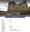

# John Donald Ross
(29 October, 1900 - 26 January, 1917)

## Immediate Family

* Brother: X
* Father: [John Hugh Ross](./@75057664@-john-hugh-ross-b1859-6-19-d1941-10-7.md) (19/Jun/1859 - 7/Oct/1941)
* Mother: [Marion Cumming](./@59851647@-marion-cumming-b1863-5-20-d1944-11-18.md) (20/May/1863 - 18/Nov/1944)
* Sister: [Ann Ross](./@52613824@-ann-ross-b1890-11-28-d1980-6-27.md) (28/Nov/1890 - 27/Jun/1980)
* Brother: [James Ross](./@62357517@-james-ross-b1893-d.md) (1893 - )
* Sister: [Jessie Ross](./@49602674@-jessie-ross-b1895-d.md) (1895 - )
* Brother: [Hugh Alexander Ross](./@22731476@-hugh-alexander-ross-b1896-11-17-d.md) (17/Nov/1896 - )
* Sister: [Marion Ross](./@39695489@-marion-ross-b1900-d.md) (1900 - )

## Timeline

Date | Item | Description | Sources | Notes
---|---|---|---|---
29/Oct/1900 | Born | Born to [John Hugh Ross](./@75057664@-john-hugh-ross-b1859-6-19-d1941-10-7.md) and [Marion Cumming](./@59851647@-marion-cumming-b1863-5-20-d1944-11-18.md) in Embo, Sutherland, Scotland. | [1](#1) | 
26/Jan/1917 | Died | Died in , At Sea. | [2](#2), [3](#3), [4](#4), [5](#5) | 

## Known Residences

Date | Residence | Sources & Notes
---|---|---
1901 | 1 Front Street, Embo, Sutherland, Scotland | [6](#6)

## Known Occupations

Date | Occupation | Sources & Notes
---|---|---
1917 | Mercantile Marine | [4](#4)

## Footnotes

### 1

**1900 ROSS, JOHN DONALD (Statutory Register of Births 047/ 50)**

* [Full text and notes](../sources/@97516544@-1900-ross,-john-donald-statutory-register-of-births-047-50-.md)
* Date: 3/Nov/1900
* Responsible Agency: National Registers of Scotland
* References: 
  * 1900 B 047/ 50

### 2

**1917 ROSS, DONALD JOHN (Register of the Mercantile Marine Memorial)**

* [Full text and notes](../sources/@75198717@-1917-ross,-donald-john-register-of-the-mercantile-marine-memorial-.md)
* Publication: Register of the Mercantile Marine Memorial, Part Seven
* Originator / Author: Imperial War Graves Commission
* Date: 1928

### 3

**1917 ROSS, JOHN D (Register of Deceased Seamen 1917)**

* [Full text and notes](../sources/@28339740@-1917-ross,-john-d-register-of-deceased-seamen-1917-.md)

### 4

**1917 ROSS, JOHN DONALD (Scottish National War Memorial)**

* [Full text and notes](../sources/@79376054@-1917-ross,-john-donald-scottish-national-war-memorial-.md)
* References: 
  * (URL) https://www.snwm.org/roll-search
* 

### 5

**1917 ROSS, JOHN DONALD Cadet (Find a Grave)**

* [Full text and notes](../sources/@61547438@-1917-ross,-john-donald-cadet-find-a-grave-.md)
* References: 
  * (URL) https://www.findagrave.com/memorial/15371569/john-donald-ross

### 6

**1901 ROSS, JOHN + HOUSEHOLD (Census 047/ 2/ 22)**

* [Full text and notes](../sources/@45903628@-1901-ross,-john-+-household-census-047-2-22-.md)
* Date: 1901
* Responsible Agency: National Records of Scotland
* References: 
  * 1901 C 047/ 2/ 22

