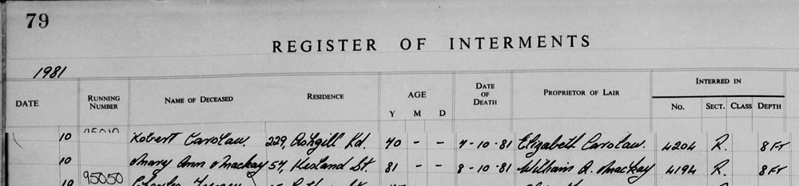

# 1981 MACKAY, MARY ANN (Register of Interments, Western Necropolis, Glasgow)

## Metadata

Field | Detail
---:|:---
Source Created | 29/Apr/2025 22:51:39
Source Last Updated | 29/Apr/2025 23:05:51

## Text

> (Extract)
>
>  
>
> REGISTER OF INTERMENTS
>
> Page 79
>
> Year: 1981
>
> Date: 10 October
>
> Name of Deceased: Mary Ann Mackay
>
> Residence: 57 Kersland St.
>
> Age: 81
>
> Date of Death: 8-10-81
>
> Proprietor of Lair: William A. Mackay
>
> Interred in: No. 4194, Sec. R, Depth 8ft
>

## Images

### Extract from the Register of Interments

on 10th of October 1981

## Source Referenced by

* Cumming
  * [Alexandrina Cumming](../people/@57186713@-alexandrina-cumming-b1891-3-30-d1987-4-10.md) (30/Mar/1891 - 10/Apr/1987)
  * [Christine Cumming](../people/@24328630@-christine-cumming-b1904-12-15-d1996-11-10.md) (15/Dec/1904 - 10/Nov/1996)
  * [Donald John Cumming](../people/@22331378@-donald-john-cumming-b1906-11-29-d1986-3-15.md) (29/Nov/1906 - 15/Mar/1986)
  * [Isabella Cumming](../people/@84684994@-isabella-cumming-b1888-7-21-d1986-2-1.md) (21/Jul/1888 - 1/Feb/1986)
  * [Mary Ann Cumming](../people/@48241984@-mary-ann-cumming-b1900-7-26-d1981-10-8.md) (26/Jul/1900 - 8/Oct/1981)
* Mackay
  * [Donald James Mackay](../people/@43065376@-donald-james-mackay-b1931-d2011-12-29.md) (1931 - 29/Dec/2011)
  * [Isabella Mackay](../people/@25303611@-isabella-mackay-b1936-1-1-d2019-12-19.md) (1/Jan/1936 - 19/Dec/2019)
  * [William Alexander Mackay](../people/@9383584@-william-alexander-mackay-b1900-2-24-d1982-9-24.md) (24/Feb/1900 - 24/Sep/1982)
* MacKay
  * [Anna Jessie MacKay](../people/@41265374@-anna-jessie-mackay-b1938-7-7-d2021-3-12.md) (7/Jul/1938 - 12/Mar/2021)
