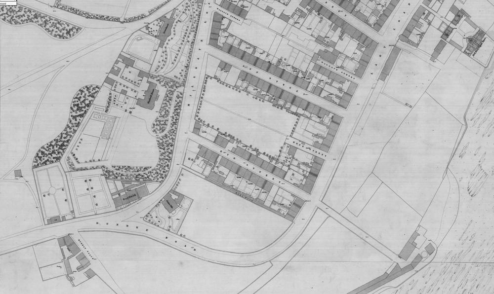

# 1891 MITCHELL, THOMAS & HOUSEHOLD (1891 Census)

## Metadata

Field | Detail
---:|:---
Responsible Agency | National Records of Scotland
Source Created | 5/Apr/2026 23:11:38
Source Last Updated | 5/Apr/2026 23:42:37

## Text

> 1891 Scottish Census
>
> Civil Parish of Arbroath
>
> Quoad Sacra Parish of Ladyloan
>
> School Board District of Arbroath
>
> Parliamentary Burgh of Arbroath
>
> Burgh Ward of Millgate
>
> Royal Burgh of Arbroath
>
>  
>
> ---
>
>  
>
> Name: Thomas Mitchell
>
> Relation: Head
>
> Condition: Married
>
> Age: 31
>
> Sex: M
>
> Profession: Lath Splitter
>
> Where Born: Forfar: Arbroath
>
>  
>
> Name: Mary Ann Mitchell
>
> Relation: Wife
>
> Condition: Married
>
> Age: 30
>
> Sex: F
>
> Where Born: Midlothian, Edinburgh
>
>  
>
> Name: Robert Mitchell
>
> Relation: Son
>
> Age: 5
>
> Sex: M
>
> Where Born: Forfar, Arbroath
>
>  
>
> Name: Violet Mitchell
>
> Relation: Daughter
>
> Age: 2
>
> Sex: F
>
> Where Born: Forfar, Arbroath
>
>  
>
> Name: Thomas Mitchell
>
> Relation: Son
>
> Age: 2 months
>
> Sex: M
>
> Where Born: Forfar, Arbroath
>

## Images

### Kyd Street, Arbroath

in 1858

[Reproduced with the permission of the National Library of Scotland](https://maps.nls.uk)

Kyd Street no longer exists, but ran betweem Millgate Loan and Lady Loan near the juncrtion with Dundee Road which all do still exist.

## Source Referenced by

* Black
  * [Mary Ann Black](../people/@94950024@-mary-ann-black-b1861-d.md) (1861 - )
* Mitchell
  * [Robert Mitchell](../people/@86070232@-robert-mitchell-b1886-d.md) (1886 - )
  * [Thomas Mitchell](../people/@47829915@-thomas-mitchell-b1860-d.md) (1860 - )
  * [Thomas Mitchell](../people/@65815518@-thomas-mitchell-b1891-2-2-d1972-5-4.md) (2/Feb/1891 - 4/May/1972)
  * [Violet Mitchell](../people/@73739848@-violet-mitchell-b1889-d.md) (1889 - )
