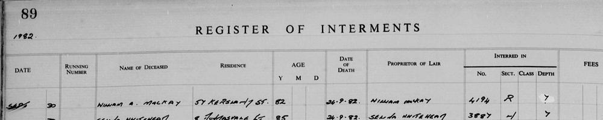

# 1982 MACKAY, WILLIAM A (Register of Interments, Western Necropolis, Glasgow)

## Metadata

Field | Detail
---:|:---
Source Created | 29/Apr/2025 22:40:34
Source Last Updated | 29/Apr/2025 22:48:26

## Text

> (Extract)
>
>  
>
> REGISTER OF INTERMENTS
>
>  
>
> Page: 89
>
> Year: 1982
>
> Date: SEP 30
>
> Running Number: 95458
>
> Name of Deceased: William A. Mackay
>
> Residence: 57 Kersland St.
>
> Age: 82
>
> Date of Death: 24.9.82
>
> Proprietor of Lair: William McKay
>
> Interred in: No. 4194, Sec. R, Depth 7
>

## Images

### Extract from the Register of Interments

on 30th of September 1982

## Source Referenced by

* [Donald James Mackay](../people/@43065376@-donald-james-mackay-b1931-d2011-12-29.md) (1931 - 29/Dec/2011)
* [Isabella Mackay](../people/@25303611@-isabella-mackay-b1936-1-1-d2019-12-19.md) (1/Jan/1936 - 19/Dec/2019)
* [William Alexander Mackay](../people/@9383584@-william-alexander-mackay-b1900-2-24-d1982-9-24.md) (24/Feb/1900 - 24/Sep/1982)
* [Anna Jessie MacKay](../people/@41265374@-anna-jessie-mackay-b1938-7-7-d2021-3-12.md) (7/Jul/1938 - 12/Mar/2021)
