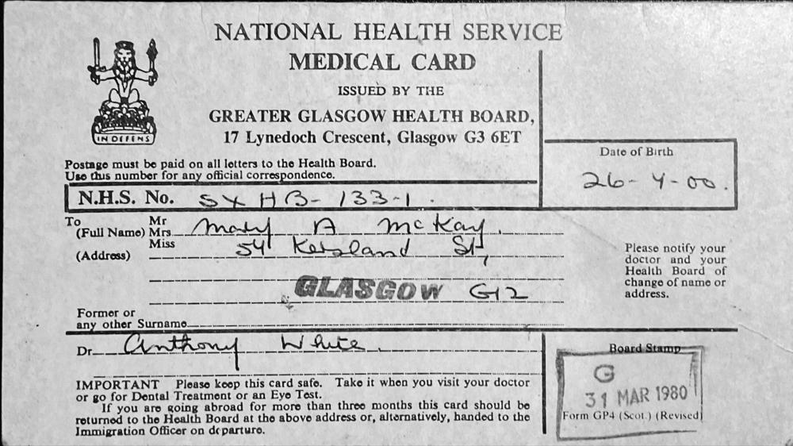

# 1980 MACKAY, MARY A (National Health Service Medical Card)

Field | Detail
---:|:---
Date | 31/Mar/1980
Responsible Agency | Greater Glasgow Health Board
References | (NHS Number) SXHB-133-1

## Text

> NATIONAL HEALTH SERVICE
>
> **MEDICAL CARD**
>
> Issued by the 
>
> GREATER GLASGOW HEALTH BOARD
>
> 17 Lynedoch Crescent, Glasgow G3 6ET
>
>  
>
> N.H.S. No. SXHB-133-1
>
> Date of Birth 26-7-00
>
>  
>
> Full Name: Mary A McKay
>
> Address: 57 Kersland Street, GLASGOW G12
>
>  
>
> Doctor: Anthony White
>
>  
>
> Board Stamp: **G** 31 MAR 1980
>

## Images

### NHS Medical Card

on 31st of March 1980

## Source Referenced by

* [Alexandrina Cumming](../people/@57186713@-alexandrina-cumming-b1891-3-30-d1987-4-10.md) (30/Mar/1891 - 10/Apr/1987)
* [Donald J Cumming](../people/@20465544@-donald-j-cumming-b1861-3-22-d1940-2-28.md) (22/Mar/1861 - 28/Feb/1940)
* [George Davidson Smith Cumming](../people/@13773669@-george-davidson-smith-cumming-b1898-5-31-d1965-8.md) (31/May/1898 - Aug/1965)
* [Isabella Cumming](../people/@84684994@-isabella-cumming-b1888-7-21-d1986-2-1.md) (21/Jul/1888 - 1/Feb/1986)
* [James Cumming](../people/@492889@-james-cumming-b1894-11-7-d1975-7-2.md) (7/Nov/1894 - 2/Jul/1975)
* [Jessie Ann Cumming](../people/@66222886@-jessie-ann-cumming-b1893-1-8-d1978-10-31.md) (8/Jan/1893 - 31/Oct/1978)
* [Mary Ann Cumming](../people/@48241984@-mary-ann-cumming-b1900-7-26-d1981-10-8.md) (26/Jul/1900 - 8/Oct/1981)
* [Ann Fraser](../people/@70425788@-ann-fraser-b1865-9-18-d1946-6-20.md) (18/Sep/1865 - 20/Jun/1946)
