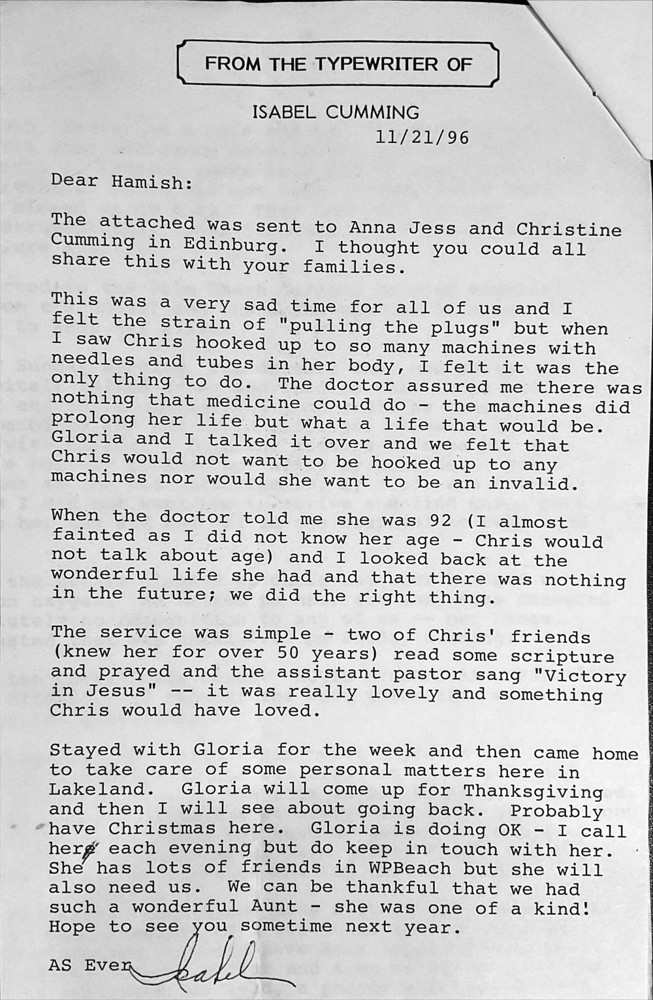
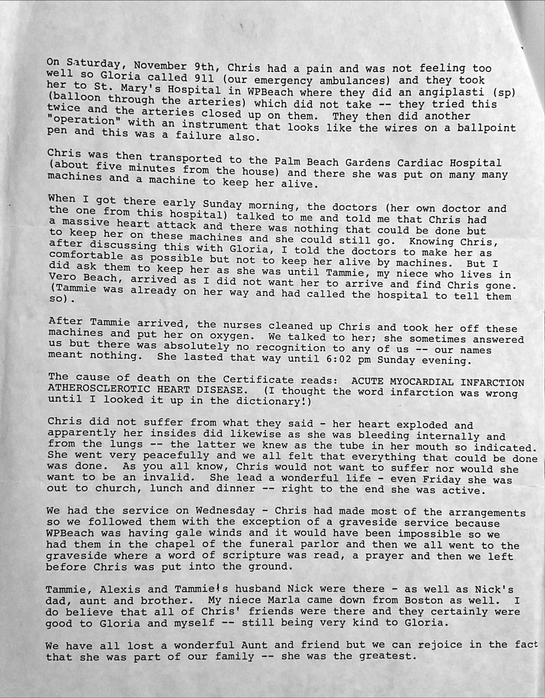
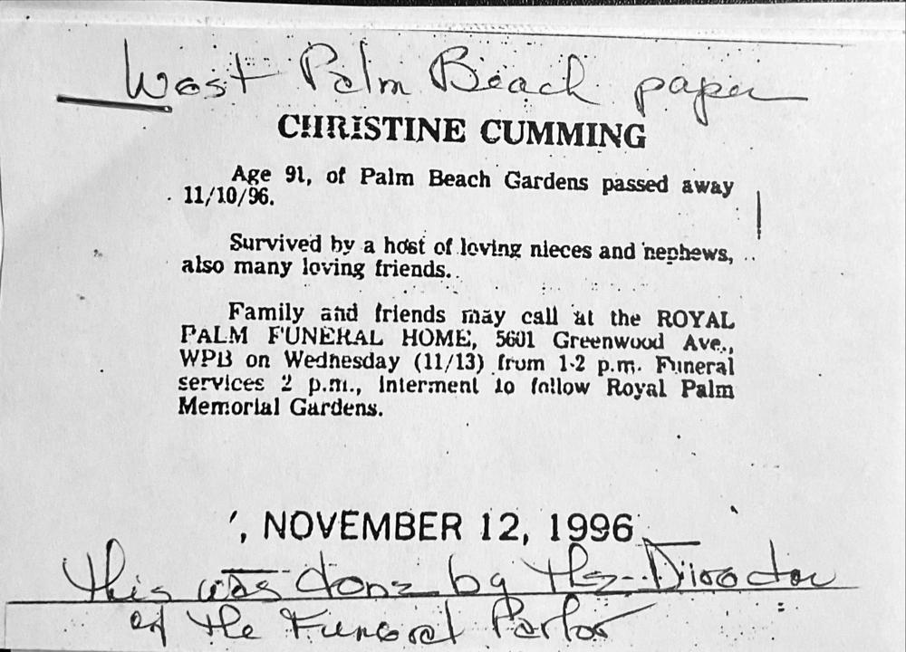
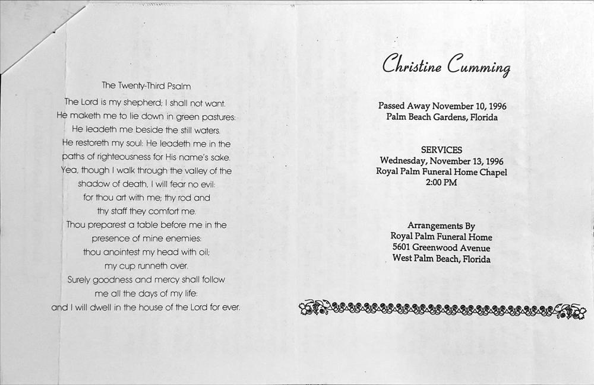

# 1996 CUMMING, CHRISTINE (Letter from Isabel Cumming to Hamish Mackay)

Field | Detail
---:|:---
Originator / Author | Isabel Cumming
Date | 21/Nov/1996

## Text

> FROM THE TYPEWRITER OF ISABEL CUMMING
>
> 11/21/96
>
>  
>
> Dear Hamish:
>
>  
>
> The attached was sent to Anna Jess and Christine Cumming in Edinburg (sic). I thought you could all share this with families.
>
>  
>
> This was a very sad time for all of us and I felt the strain of "pulling the plugs" but when I saw Chris hooked up to so many machines with needles and tubes in her body, I felt it was the only thing to do. The doctor assured me there was nothing that medicine could do - the machines did prolong her life but what a life that would be. Gloria and I talked it over and we felt that Chris would not want to be hooked up to any machines nor would she want to be an invalid.
>
>  
>
> When the doctor told me she was 92 (I almost fainted as I did not know her age - Chris would not talk about age) and I looked back at the wonderful life she had and that there was nothing in the future; we did the right thing.
>
>  
>
> The service was simple - two of Chris' friends (knew her for over 50 years) read some scripture and prayed and the assistant pastor sang "Victory in Jesus" -- it was really lovely and something Chris would have loved.
>
>  
>
> Stayed with Gloria for the week and then came home to take care of some personal matters here in Lakeland. Gloria will come up for Thanksgiving and then I will see about going back. Probably have Christmas here. Gloria is doing OK - I call her each evening but do keep in touch with her. She has lots of friends in WPBeach but she will also need us. We can be thankful that we had such a wonderful Aunt - she was one of a kind! Hope to see you sometime next year.
>
>  
>
> As Ever,
>
> Isabel.
>
>  
>
> ---
>
>  
>
> On Saturday, November 9th, Chris had a pain and was not feeling too well so Gloria called 911 (out emergency ambulances) and they took her to St. Mary's Hospital in WPBeach where they did an angiplasti (sp) (balloon through the arteries) which did not take -- they tried this twice and the arteries closed up on them. They then did another "operation" with an instrument that looks like the wires on a ballpoint pen and this was a failure also.
>
>  
>
> Chris was then transported to the Palm Beach Gardens Cardiac Hospital (about five minutes from the house) and there she was put on many machines and a machine to keep her alive.
>
>  
>
> When I got there early Sunday morning, the doctors (her own doctor and the one from the hospital) talked to me and told me that Chris had a massive heart attack and there was nothing that could be done but to keep her on these machines and she could still go. Knowing Chris, after discussing this with Gloria, I told the doctors to make her as comfortable as possible but not to keep her alive by machines. But I did askthem to keep her as she was until Tammie, my niece who lives in Vero Beach, arrived as I did not want her to find Chris gone. (Tammie was already on her way and had called the hospital to tell them so).
>
>  
>
> After Tammie arrived, the nurses cleaned up Chris and took her off these machines and put her on oxygen. We talked to her; she sometimes answered us but there was absolutely no recognition to any of us -- our names meant nothing. She lasted that way until 6.02 pm Sunday evening.
>
>  
>
> The cause of death on the Certificate reads: ACUTE MYOCARDIAL INFARCTION ATHEROSCLEROTIC HEART DISEASE. (I thought the word infarction was wrong until I looked it up in the dictionary!)
>
>  
>
> Chris did not suffer from what they said - her heart exploded and apparently her insides did likewise as she was bleeding internally and from the lungs -- the latter we know as the tube in her mouth so indicated. She went peacefully and we all felt that everything that could be done was done. As you all know, Chris would not want to suffer nor would she want to be an invalid. She lead a wonderful life - even Friday she was out to Church, lunch and dinner -- right to the end she was active.
>
>  
>
> We had the service on Wednesday - Chris had made most of the arrangements so we followed when with the exception of a graveside service because WPBeach was having gale winds and it would have been impossible so we had them in the chapel of the funeral parlor and then we all went to the graveside where a word of scripture was read, a prayer and then we left before Chris was put into the ground.
>
>  
>
> Tammie, Alexis and Tammie's husband Nick were there - as well as Nick's dad, aunt and brother. My niece Marla came down from Boston as well. I do believe that all of Chris' friends were there and they certainly were good to Gloria and myself -- still being very kind to Gloria.
>
>  
>
> We have lost a wonderful Aunt and friend but we can rejoice in the fact that she was part of our family -- she was the greatest. 
>
>  
>
> ---
>
>  
>
> (handwritten) West Palm Beach paper
>
>  
>
> CHRISTINE CUMMING
>
>  
>
> Age 91, of Palm Beach Gardens passed away 11/10/96
>
>  
>
> Survived by a host of loving nieces and nephews, and also many loving friends.
>
>  
>
> Family and friends may call at the ROYAL PALM FUNERAL HOME, 5601 Greenwood Ave., WPB on Wednesday (11/13) from 1-2 p.m. Funeral services 2 p.m., interment to follow Royal Palm Memorial Gardens
>
>  
>
> (stamped) NOVEMBER 12, 1996
>
>  
>
> (handwritten) This was done by the Director of the Funeral Parlor
>
>  
>
> ---
>
>  
>
> Christine Cumming
>
>  
>
> Passed Away November 10, 1996
>
> Palm Beach Gardens, Florida
>
>  
>
> SERVICES
>
> Wednesday, November 13, 1996
>
> Royal Palm Funeral Home Chapel
>
> 2:00 PM
>
>  
>
> Arrangements By
>
> Royal Palm Beach Funeral Home
>
> 5601 Greenwood Avenue
>
> West Palm Beach, Florida
>
>  
>
> The Twenty-Third Psalm
>
>  
>
> The Lord is my shepherd; I shall not want.
>
> He maketh me to lie down in green pastures;
>
> He leadeth me beside the still waters.
>
> He restoreth my soul; He leadeth me in the
>
> paths of righeousness for His name's sake.
>
> Yea, though I walk through the valley of the
>
> shadow of death. I will fear no evil;
>
> for thou art with me, thy rod and
>
> thy staff they comfort me.
>
> Thou preparest a table before me in the
>
> presence of mine enemies;
>
> thou anointest my head with oil;
>
> my cup runeth over.
>
> Surely goodness and mercy shall follow
>
> me all the days of my life;
>
> and I will dwell in the house of the Lord for ever.
>

## Images

### 1 - Letter

on 21st of November 1996

### 2 - Attachment note

in November 1996

### 3 - attachment: newspaper notice

on 12th of November 1996

### 4 - attachment: Funeral Program

on 13th of November 1996

## Source Referenced by

* [Christine Cumming](../people/@24328630@-christine-cumming-b1904-12-15-d1996-11-10.md) (15/Dec/1904 - 10/Nov/1996)
* [Isabelle Anne Cumming](../people/@44164031@-isabelle-anne-cumming-b1923-7-29-d.md) (29/Jul/1923 - )
