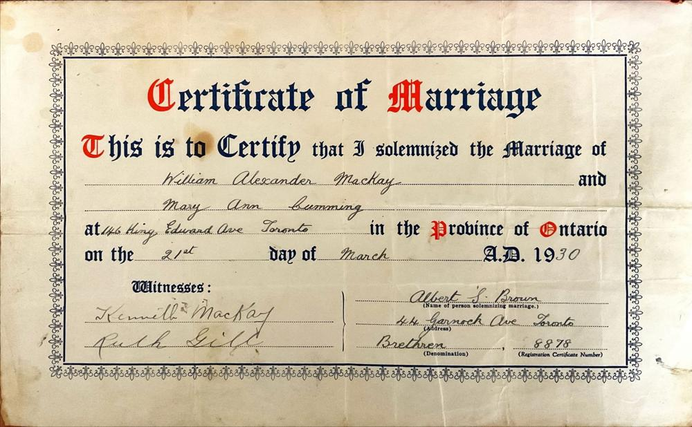

# 1930 MACKAY, WILLIAM ALEXANDER & CUMMING, MARY ANN (Marriage Certificate)

Field | Detail
---:|:---
Date | 21/Mar/1930
References | (Registration Certificate Number) 8878

## Text

> Certificate of Marriage
>
>  
>
> This is to Certify that I solemnized the Marriage of
>
> William Alexander Mackay and
>
> Mary Ann Cumming
>
> at 146 King Edward Avenue, Toronto in the Province of Onatario
>
> on the 21st day of March A.D. 1930
>
>  
>
> Witnesses:
>
> * Kenneth Mackay
>
> * Ruth Gill
>
>  
>
> Name of Person Solemnizing Marriage: Albert S. Brown
>
> Address: 44 Garnock Ave, Toronto
>
> Denomination: Bretheren
>
> Registration Certificate Number: 8878
>

## Images

### Certificate of Marriage - William Alexander Mackay & Mary Ann Cumming

on 21st of March 1930

## Source Referenced by

* [Mary Ann Cumming](../people/@48241984@-mary-ann-cumming-b1900-7-26-d1981-10-8.md) (26/Jul/1900 - 8/Oct/1981)
* [William Alexander Mackay](../people/@9383584@-william-alexander-mackay-b1900-2-24-d1982-9-24.md) (24/Feb/1900 - 24/Sep/1982)
