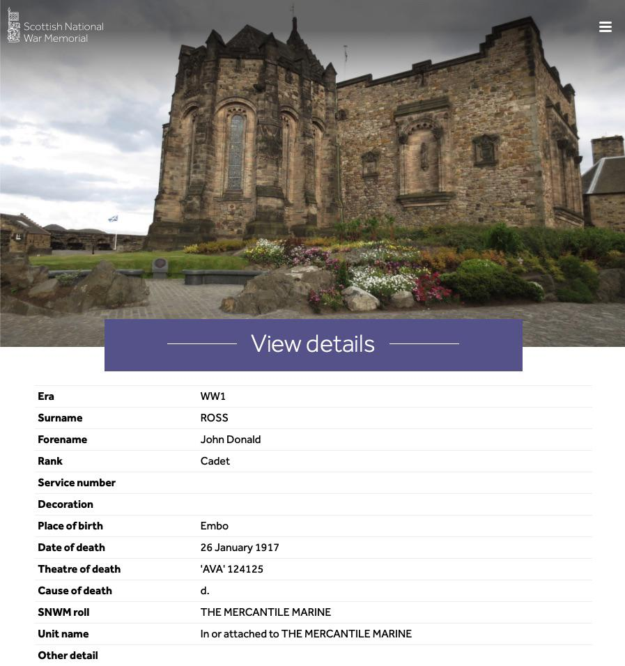

# 1917 ROSS, JOHN DONALD (Scottish National War Memorial)

## Metadata
Field | Detail
---:|:---
References | (URL) [Open original source at https://www.snwm.org/roll-search](https://www.snwm.org/roll-search)
Source Created | 25/May/2025 20:25:55
Source Last Updated | 25/May/2025 20:30:06

## Text

> Era: WW1
>
> Surname: ROSS
>
> Forename: John Donald
>
> Rank: Cadet
>
> Service number 
>
> Decoration 
>
> Place of birth: Embo
>
> Date of death: 26 January 1917
>
> Theatre of death: 'AVA' 124125
>
> Cause of death: d.
>
> SNWM roll: THE MERCANTILE MARINE
>
> Unit name: In or attached to THE MERCANTILE MARINE
>

## Images

### John Donald Ross Memorial Entry

## Source Referenced by

* [Marion Cumming](../people/@59851647@-marion-cumming-b1863-5-20-d1944-11-18.md) (20/May/1863 - 18/Nov/1944)
* [Ann Ross](../people/@52613824@-ann-ross-b1890-11-28-d1980-6-27.md) (28/Nov/1890 - 27/Jun/1980)
* [John Donald Ross](../people/@60714754@-john-donald-ross-b1900-10-29-d1917-1-26.md) (29/Oct/1900 - 26/Jan/1917)
* [John Hugh Ross](../people/@75057664@-john-hugh-ross-b1859-6-19-d1941-10-7.md) (19/Jun/1859 - 7/Oct/1941)
