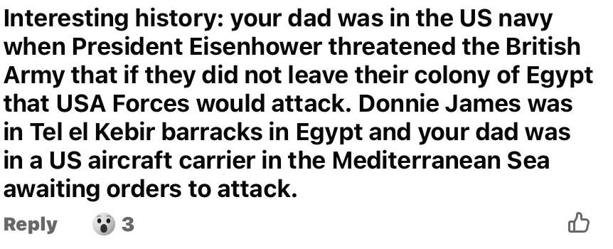

# 2026 MACKAY, GEORGE (Facebook message)

## Metadata

Field | Detail
---:|:---
Source Created | 4/Apr/2026 15:50:59
Source Last Updated | 4/Apr/2026 15:54:11

## Text

> This was on a facebook message between George Mackay and Deanna Roberts in 2026
>
>  
>
> Interesting history: your dad (Derry Roberts) was in the US navy when President Eisenhower threatened the British Army that if they did not leave their colony of Egypt that USA Forces would attack. Donnie James (Mackay) was in Tel el Kebir barracks in Egypt and your dad was in a US aircraft carrier in the Mediterranean Sea awaiting orders to attack.
>

## Images

### 

## Source Referenced by

* Mackay
  * [Donald James Mackay](../people/@43065376@-donald-james-mackay-b1931-d2011-12-29.md) (1931 - 29/Dec/2011)
* Roberts
  * [Derry Roberts](../people/@38836920@-derry-roberts-b1936-2-8-d2025-12-8.md) (8/Feb/1936 - 8/Dec/2025)
